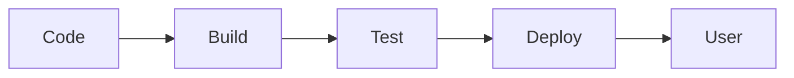
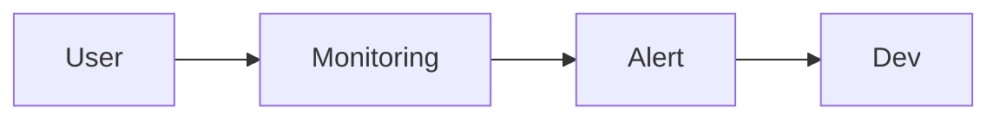

# DevOps คืออะไร <Badge type="info" text="Module 1 · สัปดาห์ 1–2" />

> **Ref Book:** The DevOps Handbook (Gene Kim et al.) — Part I: The Three Ways, Ch. 1–2

::: warning 🖥️ ยังไม่ได้ตั้งค่าเครื่องใช่ไหม?
**ทำ Lab Setup ก่อนอ่านเนื้อหานี้** — บทเรียนตั้งแต่ wk2 เป็นต้นไปใช้ Git, Node.js และ Docker  
👉 [Lab 1: ตั้งค่า Dev Environment (Git, Node.js, Docker)](/wk1/wk1-lab1-env-setup)  
ใช้เวลาประมาณ 40 นาที ทำครั้งเดียวตลอดหลักสูตร
:::

::: danger 🚨 สถานการณ์จริง
บริษัทหนึ่งทำงานมา 3 เดือน เตรียม release ใหม่ — วันที่ deploy ระบบล่มทันที ทีม Dev โทษ Ops ว่าตั้งค่า server ผิด ทีม Ops โทษ Dev ว่า code ไม่ผ่านการทดสอบ ใช้เวลา 2 วันกว่าจะแก้ได้ และปัญหานั้นเกิดซ้ำทุก release

นี่คือสิ่งที่เรียกว่า **"Wall of Confusion"** — กำแพงที่ DevOps สร้างมาเพื่อทลาย
:::

> 💡 **เปรียบเทียบ:** DevOps เหมือนโรงครัวที่ chef กับ waiter ทำงานร่วมกันในห้องเดียว — ต่างจากโรงครัวเก่าที่ chef ทำอาหารเสร็จแล้วโยนผ่านช่องหน้าต่างให้ waiter โดยไม่คุยกัน


## 🤔 DevOps เกิดขึ้นมาแก้ปัญหาอะไร?

ก่อนจะเข้าใจ DevOps ต้องเข้าใจปัญหาที่มันแก้ก่อน

ลองนึกภาพองค์กรซอฟต์แวร์ทั่วไปสมัย 2000s:

- ทีม **Dev** (นักพัฒนา) เขียน code → สร้าง feature → อยากส่ง feature บ่อยๆ เร็วๆ
- ทีม **Ops** (ระบบ/server) ดูแล production → อยากให้ระบบ **stable** ไม่อยากให้อะไรเปลี่ยน

ผลที่เกิดขึ้น: **สองทีมมีเป้าหมายที่ขัดแย้งกัน**

```
Dev: "ทำไม deploy ช้าจัง รอ 3 เดือน!"
Ops: "ทำไม code เธอพัง production ตลอด!"
```

::: warning ผลกระทบจริงในอุตสาหกรรม
บริษัทหนึ่ง deploy software ปีละ **2 ครั้ง** และใช้เวลา **3 เดือน** เตรียม deploy แต่ละครั้ง  
ขณะที่ Amazon deploy ทุก **11.7 วินาที** — ความต่างนี้คือสิ่งที่ DevOps แก้
:::


## 🔑 DevOps คืออะไร (ความหมายจริง)

**DevOps** ไม่ใช่ตำแหน่งงาน ไม่ใช่ tool และไม่ใช่แค่ automation

> DevOps คือ **วัฒนธรรมและแนวปฏิบัติ** ที่ทำให้ทีม Development และ Operations ทำงานร่วมกันได้ มีเป้าหมายเดียวกัน และส่ง software ถึงมือ user ได้เร็ว มีคุณภาพ และ stable

คำสำคัญ: **Culture + Automation + Measurement + Sharing** (CAMS)

| หลัก | ความหมาย |
| :--- | :--- |
| **Culture** | ทีมทำงานร่วมกัน ไม่โทษกัน มีเป้าหมายเดียว |
| **Automation** | ลด manual work — build, test, deploy ต้องรันเอง |
| **Measurement** | วัดผลจริง — deploy frequency, MTTR, error rate |
| **Sharing** | แชร์ความรู้, tool, process ระหว่างทีม |


## ♾️ Three Ways of DevOps

หัวใจของ DevOps อธิบายผ่าน **Three Ways** จาก The DevOps Handbook:

### The First Way — Flow (ความเร็วของงาน)

งานต้องไหลจาก Dev → Ops → User ได้เร็วและราบรื่น



แนวปฏิบัติ:
- ใช้ **CI/CD pipeline** ให้งานไหลอัตโนมัติ
- ทำ batch ให้เล็กลง — commit เล็กๆ บ่อยๆ ดีกว่า commit ใหญ่นานๆ ครั้ง
- ห้ามให้งานค้างในขั้นตอนใดขั้นตอนหนึ่ง

### The Second Way — Feedback (ข้อมูลย้อนกลับเร็ว)

ต้องรู้ **ทันที** ถ้ามีปัญหา — ไม่ใช่รู้หลังจาก deploy ผ่านไป 3 เดือน



แนวปฏิบัติ:
- Run test อัตโนมัติทุกครั้งที่ push code
- มี monitoring บน production
- ทำ code review → feedback ก่อน merge

### The Third Way — Continual Learning & Experimentation

องค์กรต้องเรียนรู้จากความผิดพลาด ไม่ตำหนิคน

```mermaid
graph LR
    ทดลอง --> ผิดพลาด --> เรียนรู้ --> ปรับปรุง --> ทดลองใหม่
```

แนวปฏิบัติ:
- **Blameless Post-mortem** — วิเคราะห์ root cause โดยไม่โทษบุคคล
- สนับสนุนการทดลอง feature ใหม่
- แชร์ความรู้ข้ามทีม


## 🏢 ก่อน DevOps vs หลัง DevOps

::: info เปรียบเทียบ
| หัวข้อ | ก่อน DevOps | หลัง DevOps |
| :--- | :--- | :--- |
| ความรับผิดชอบ | Dev เขียน, Ops deploy | ทุกคนรับผิดชอบ production |
| Deployment | ทีม Ops deploy manual | Pipeline deploy อัตโนมัติ |
| เมื่อระบบพัง | โทษกัน | Post-mortem ร่วมกัน |
| ความเร็ว | Deploy ปีละ 2–4 ครั้ง | Deploy วันละหลาย 10 ครั้ง |
| ทดสอบ | QA team ทดสอบตอนท้าย | ทดสอบอัตโนมัติทุก commit |
:::


## 🗺️ Value Stream — จาก Code บรรทัดแรกถึงมือ User

**Value Stream** คือทุกขั้นตอนที่ทำให้ feature ถึงมือ user:


::: tip ตัวอย่างจริง — Task Tracker project
| ขั้นตอน | Process Time | Lead Time (รอ) |
| :--- | :---: | :---: |
| เขียน code | 2 วัน | 2 วัน |
| รอ code review | — | 3 วัน |
| รอ QA test | — | 5 วัน |
| รอ Ops approve | — | 7 วัน |
| **รวม** | **2 วัน** | **17 วัน** |

DevOps เป้าหมาย: ลด lead time จาก 17 วัน → ไม่กี่ชั่วโมง
:::


## 🤖 AI Prompt Guide

::: info 💬 ถาม AI เมื่อติดปัญหา
```
"ฉันเพิ่งเรียน DevOps Three Ways
ช่วยอธิบายว่าถ้าทีมมีปัญหา [ระบุปัญหา] เช่น deploy ช้า หรือ bug เจอช้า
DevOps แก้ด้วย Way ไหน และใช้ tool อะไรได้บ้าง?"
```
:::


## ✅ Progress Check

### 🗣️ Code Review

::: details ❓ คำถาม 1: DevOps vs Agile — ต่างกันอย่างไร และใช้ร่วมกันได้ไหม?
**แนวคำตอบ:** Agile กำหนดวิธี**จัดการงาน** (sprint, backlog, standup) — DevOps กำหนดวิธี**ส่งงาน** (CI/CD, automation, monitoring) ต่างกันเชิง scope: Agile โฟกัส Dev team; DevOps รวม Dev + Ops + QA ใช้ร่วมกันได้และควรใช้คู่กัน — Agile เร่งทีม Dev, DevOps เร่ง delivery ถึง production
:::

::: details ❓ คำถาม 2: "Wall of Confusion" เกิดขึ้นได้อย่างไร และ DevOps แก้มันด้วยวิธีไหน?
**แนวคำตอบ:** เกิดเพราะ Dev และ Ops มีเป้าหมายขัดแย้ง — Dev อยากส่ง feature เร็ว, Ops อยากให้ระบบ stable ไม่เปลี่ยนแปลง DevOps แก้ด้วย: (1) ทีมรวมกันมี shared responsibility (2) pipeline automation ลด manual handoff (3) blameless culture ทำให้สองฝ่ายร่วมแก้ปัญหา ไม่โทษกัน
:::

::: details ❓ คำถาม 3: ถ้า production ล่มตอนตี 2 และคุณเป็น DevOps engineer คุณทำอะไรก่อน?
**แนวคำตอบ:** ตาม Three Ways — (1) **Detect** ด้วย monitoring/alert ที่ตั้งไว้ล่วงหน้า (Second Way) (2) **Rollback** ก่อนเพื่อ restore service เร็วที่สุด ไม่ debug ใน production (First Way: Flow ต้องไม่ติดนาน) (3) **Post-mortem** หลังระบบกลับมา วิเคราะห์ root cause โดยไม่โทษคน (Third Way: Learning)
:::

::: details ❓ คำถาม 4: ทำไม batch เล็กๆ บ่อยๆ ถึงดีกว่า batch ใหญ่นานๆ ครั้ง?
**แนวคำตอบ:** batch ใหญ่ = ความเสี่ยงสะสม — ถ้าพังไม่รู้ว่า change ไหนทำให้พัง, แก้ยาก batch เล็ก = deploy ครั้งละ 1–2 change → ถ้าพังรู้ทันทีว่าเพราะอะไร, rollback ง่าย เหมือนการ save game บ่อยๆ — ถ้า die ก็แค่ restart จาก checkpoint ล่าสุด
:::


### 📚 CLIL Vocabulary

| Technical Term | ความหมายในบริบท DevOps |
| :--- | :--- |
| `Wall of Confusion` | กำแพงความขัดแย้งระหว่างทีม Dev และ Ops เพราะมีเป้าหมายต่างกัน |
| `Value Stream` | เส้นทางทั้งหมดตั้งแต่ Idea → User รวมทุก wait time |
| `Lead Time` | เวลารวมตั้งแต่เริ่มงานจนถึง user ใช้ได้จริง (รวม wait) |
| `Process Time` | เวลาที่ทำงานจริงๆ ไม่รวมเวลารอ |
| `Blameless Post-mortem` | การวิเคราะห์ root cause หลังเกิดปัญหา โดยไม่ตำหนิบุคคล |
| `CAMS` | ย่อจาก Culture + Automation + Measurement + Sharing |
| `batch size` | ขนาดของ change ที่ deploy ครั้งหนึ่ง — เล็ก = ความเสี่ยงต่ำ |


**ถัดไป →** [SDLC Evolution: Waterfall → Agile → DevOps](/wk1/wk1-content2-sdlc-evolution)
