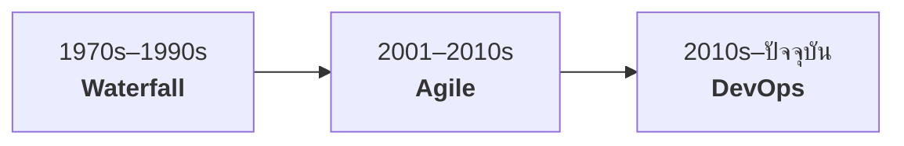
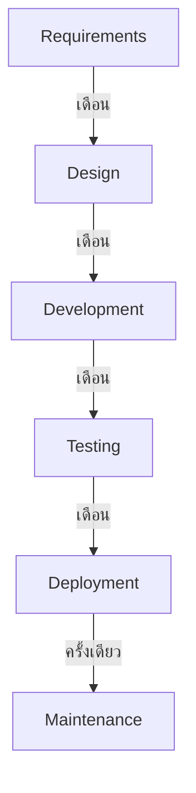
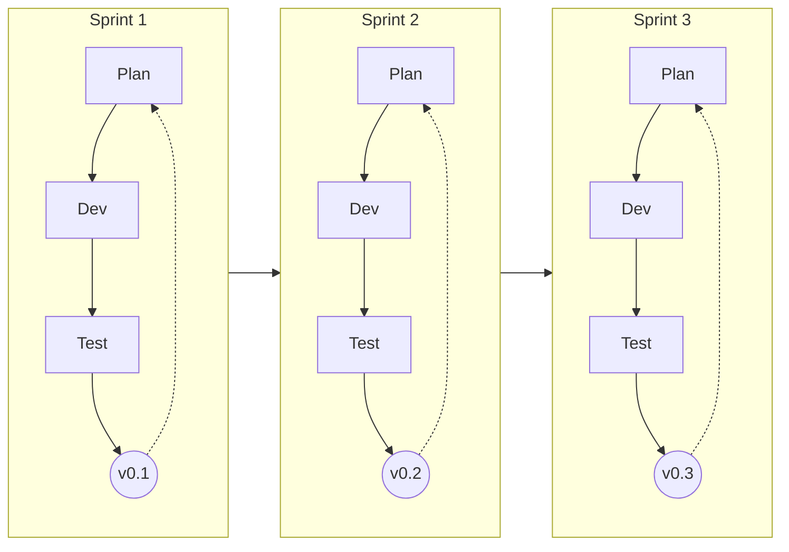
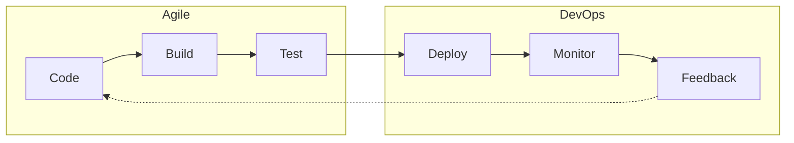

# SDLC Evolution: Waterfall → Agile → DevOps <Badge type="info" text="Module 1 · สัปดาห์ 1–2" />

> **Ref Book:** The DevOps Handbook (Gene Kim et al.) — Chapter 1: The Three Ways

::: danger 🚨 สถานการณ์จริง
ทีมพัฒนา Healthcare.gov ของรัฐบาลสหรัฐ ใช้เวลา 3 ปีกับงบ 400 ล้านดอลลาร์ในการสร้างระบบ — วันเปิดตัวปี 2013 เว็บล่มทันที ไม่มีใคร register ได้ ต้องใช้เวลาอีก 2 เดือนกว่าจะแก้ได้ สาเหตุหลัก: ใช้ **Waterfall** — ไม่มีการ test กับ user จริงจนกว่าจะเสร็จสมบูรณ์
:::

> 💡 **เปรียบเทียบ:** Waterfall เหมือนการสั่งบ้านแบบ blueprint ทั้งหลัง แล้วรอ 2 ปีให้สร้างเสร็จก่อนถึงจะเข้าไปดูครั้งแรก — Agile คือการสร้างทีละห้องและอยู่ไปด้วยระหว่างสร้าง


## 📜 SDLC คืออะไร?

**SDLC (Software Development Life Cycle)** คือกระบวนการพัฒนาซอฟต์แวร์ตั้งแต่เริ่มต้นจนถึงส่ง user ใช้งาน

ตลอด 50 ปีที่ผ่านมา SDLC เปลี่ยนแปลงมาแล้ว 3 ยุคใหญ่:




## 🏗️ ยุคที่ 1 — Waterfall (น้ำตก)

ทำงานเป็น**ขั้นตอน ไม่ย้อนกลับ** เหมือนน้ำตกไหลลงมาทางเดียว:



**เหมาะกับ:** โปรเจกต์ที่ requirements ไม่เปลี่ยน เช่น ระบบ embedded สำหรับยานอวกาศ

::: warning ปัญหาหลักของ Waterfall ที่นักพัฒนาเจอจริง
| ปัญหา | อธิบาย |
| :--- | :--- |
| **Feedback ช้า** | เจอ bug หลัง dev เสร็จแล้ว — แก้แพงมาก (กฎ 10x: ยิ่งช้าแก้ ยิ่งแพง) |
| **ไม่ flexible** | Requirements เปลี่ยนแล้วต้องเริ่มใหม่ |
| **Big Bang Release** | ส่งทีเดียวครั้งเดียว — ความเสี่ยงสูงมาก |
| **ทีมแยกกัน** | Dev ส่งงาน→QA ส่งงาน→Ops ไม่รู้จักกัน = Wall of Confusion |
:::


## 🏃 ยุคที่ 2 — Agile

### กำเนิด Agile

ปี 2001 นักพัฒนา 17 คนนัดเจอกันที่ Utah ออก **Agile Manifesto** 4 ข้อ:

> 1. **Individuals and interactions** over processes and tools
> 2. **Working software** over comprehensive documentation
> 3. **Customer collaboration** over contract negotiation
> 4. **Responding to change** over following a plan

### การทำงานแบบ Sprint

แทนที่จะส่งงานปีละครั้ง → ส่งทุก **Sprint (1–4 สัปดาห์)**:



::: warning ช่องโหว่ที่ Agile ยังแก้ไม่ได้ — DevOps เข้ามาปิด
Dev ทำงานเร็วขึ้น deploy ทุก sprint แต่ยังติดปัญหาที่ **Ops ด้าน** — deployment ยังเป็น manual, ใช้เวลานาน และเกิด error ได้ง่าย

```
Dev: "feature พร้อมแล้ว!"
Ops: "รอก่อนนะ ต้องทำ change request, รอ approval, manual deploy..."
     → รอ 2 สัปดาห์
```

Agile เร่ง Dev แต่ไม่ได้เร่ง Deployment pipeline
:::


## 🚀 ยุคที่ 3 — DevOps

### DevOps ปิด Gap ที่ Agile ทำไม่ได้



| Agile + DevOps | ผลในทางปฏิบัติ |
| :--- | :--- |
| Sprint delivery | feature พร้อมทุก 2 สัปดาห์ |
| CI/CD pipeline | เมื่อ code merge → deploy อัตโนมัติใน 30 นาที |
| Monitoring | รู้ปัญหาก่อน user รายงาน |
| Automated testing | bug จับได้ก่อน production |


## 📊 เปรียบเทียบ 3 ยุค

| หัวข้อ | Waterfall | Agile | DevOps |
| :--- | :---: | :---: | :---: |
| Release frequency | ปีละ 1–2 ครั้ง | ทุก 2–4 สัปดาห์ | วันละหลายครั้ง |
| Feedback loop | เดือน–ปี | สัปดาห์ | นาที–ชั่วโมง |
| ความเสี่ยงต่อ release | สูงมาก | ปานกลาง | ต่ำ |
| ทีมทำงาน | แยก silo | Dev team รวม | Dev + Ops รวม |
| เมื่อมี bug production | ปล่อยรอ patch | แก้ใน sprint ถัดไป | hotfix ทันที |

::: info Case Study: Netflix
- **2008:** ระบบ database ล่ม 3 วัน
- **การตัดสินใจ:** เปลี่ยนจาก monolith → microservices บน AWS
- **2011:** เริ่มใช้ Chaos Engineering (ทดสอบโดยจงใจทำระบบพัง)
- **ผลลัพธ์:** Deploy วันละ 100+ ครั้ง — 0 downtime จากการ deploy
:::


## 🤖 AI Prompt Guide

::: info 💬 ถาม AI เมื่อติดปัญหา
```
"ฉันต้องอธิบายความต่างระหว่าง Waterfall, Agile, และ DevOps
ช่วยยกตัวอย่างโปรเจกต์พัฒนา API ง่ายๆ ว่าแต่ละ approach จะทำอย่างไร
และ trade-off ของแต่ละแบบคืออะไร?"
```
:::


## ✅ Progress Check

### 🗣️ Code Review

::: details ❓ คำถาม 1: ทำไม Waterfall ถึงล้มเหลวกับ Healthcare.gov แต่ยังใช้ได้กับยานอวกาศ?
**แนวคำตอบ:** ยานอวกาศมี requirements ที่ชัดเจน ไม่เปลี่ยน และผ่าน engineering review เข้มข้น Healthcare.gov มี requirements ที่ซับซ้อน เปลี่ยนบ่อย และต้องการ user feedback ตลอด Waterfall ทำงานได้เมื่อ requirements ชัดตั้งแต่ต้น และ cost of change ต่ำ
:::

::: details ❓ คำถาม 2: Agile เร็วกว่า Waterfall แต่ DevOps ยังต้องมา เพราะอะไร?
**แนวคำตอบ:** Agile แก้ปัญหาฝั่ง Development — sprint สั้น, feedback จาก stakeholder บ่อย แต่ยังติดปัญหา "Last Mile" คือ deployment — การส่ง software จาก code ไปถึง production ยังเป็น manual, ช้า, error-prone DevOps แก้ด้วย CI/CD pipeline ที่ automate ทุกขั้นตอนหลัง merge
:::

::: details ❓ คำถาม 3: ถ้าทีมคุณยังใช้ Waterfall อยู่ คุณจะโน้มน้าวให้เปลี่ยนมา DevOps อย่างไร?
**แนวคำตอบ:** ใช้ข้อมูลจาก DORA Research: Elite DevOps teams deploy 973x บ่อยกว่า low performers และมี Change Failure Rate ต่ำกว่า แสดงให้เห็นว่า deploy บ่อยไม่ได้แปลว่าพังบ่อย เสนอเริ่มจาก quick win เช่น automated test + CI pipeline ก่อน — เห็นผลใน 2–4 สัปดาห์
:::


### 📚 CLIL Vocabulary

| Technical Term | ความหมายในบริบท DevOps |
| :--- | :--- |
| `SDLC` | Software Development Life Cycle — กระบวนการพัฒนาซอฟต์แวร์ครบวงจร |
| `Sprint` | ช่วงเวลาสั้นๆ (1–4 สัปดาห์) ที่ทีมมุ่งทำงานชุดหนึ่งให้สำเร็จ |
| `Agile Manifesto` | หลักการ 4 ข้อที่นักพัฒนา 17 คนเขียนร่วมกันปี 2001 |
| `monolith` | ระบบที่ทุก component อยู่ในโปรแกรมเดียว — เปรียบกับ microservices |
| `Big Bang Release` | การ deploy ทีเดียวทั้งหมด ความเสี่ยงสูงมาก |
| `Last Mile` | ขั้นตอนสุดท้ายจาก "code เสร็จ" → "user ใช้ได้บน production" |


**← ก่อนหน้า:** [DevOps คืออะไร](/wk1/wk1-content1-devops-intro)
**ถัดไป →** [Value Stream — หา Waste ใน Delivery Process](/wk1/wk1-content3-value-stream)
