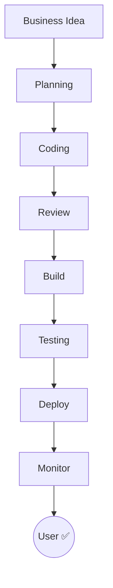
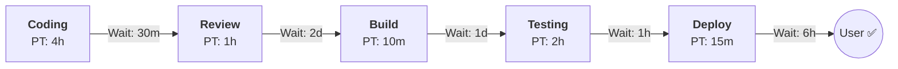
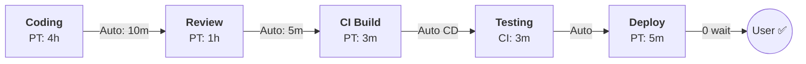

# Value Stream — หา Waste ใน Delivery Process <Badge type="info" text="Module 1 · สัปดาห์ 1–2" />

> **Ref Book:** The DevOps Handbook — Part I: The First Way (Flow), Ch. 3–4

::: danger 🚨 สถานการณ์จริง
นักพัฒนา Task Tracker ทีมหนึ่งใช้เวลา 4 ชั่วโมงเขียน feature ใหม่ แต่ feature นั้นถึงมือ user จริงหลังจากนั้น **17 วัน** — รอ code review 3 วัน รอ QA 5 วัน รอ Ops approve manual 7 วัน เวลาทำงานจริงคือ 4 ชั่วโมง efficiency = 4.9% นี่คือปัญหาที่ Value Stream Mapping ช่วยมองเห็น
:::

> 💡 **เปรียบเทียบ:** Value Stream เหมือนแผนที่โรงงานที่ขีดเส้นตามการเดินของชิ้นงาน — ถ้าชิ้นงานวนซ้ายขวาไปมาก่อนออกจากโรงงาน แปลว่ามี waste ที่สามารถตัดออกได้


## 🌊 Value Stream คืออะไร?

**Value Stream** มาจาก Lean Manufacturing — แนวคิดว่าด้วย "เส้นทางของคุณค่า" ตั้งแต่ต้นจนถึงมือลูกค้า

> Value Stream = ทุกขั้นตอนที่เปลี่ยน **ความต้องการของ user** ให้กลายเป็น **software ที่ใช้ได้จริง**




## ⏱️ Lead Time vs Process Time

ความต่างระหว่าง 2 ค่านี้คือหัวใจของการหา waste:

| คำ | ความหมาย | ตัวอย่าง |
| :--- | :--- | :--- |
| **Process Time** | เวลาที่ทำงานจริง | เขียน code 4 ชั่วโมง |
| **Lead Time** | เวลารวมทั้งหมดตั้งแต่เริ่มจนเสร็จ | task → user ใช้ได้ = 5 วัน |
| **%C/A** | % งานที่ส่งต่อได้โดยไม่ต้องรีเวิร์ค | review ผ่าน 80% |

::: warning ยิ่ง Lead Time >> Process Time ยิ่งมี Waste เยอะ
```
Process Time = 4 ชั่วโมง
Lead Time    = 5 วัน (40 ชั่วโมง)

Waste = 36 ชั่วโมง = 90% ของเวลาทั้งหมด!
```
:::


## 🗑️ Waste 7 ประเภทในซอฟต์แวร์

Lean Manufacturing นิยาม 7 ประเภทของ waste (Muda) — ใน DevOps แปลงเป็น:

| # | Waste ใน Lean | Waste ใน Software | แก้ด้วย DevOps |
| :---: | :--- | :--- | :--- |
| 1 | Overproduction | เขียน feature ที่ไม่มีใครใช้ | User research, minimum viable feature |
| 2 | Waiting | รอ review, รอ approval, รอ deploy | Automation, self-service CI/CD |
| 3 | Transportation | ส่งงานข้าม team หลายชั้น | Cross-functional team |
| 4 | Overprocessing | docs ที่ไม่มีใครอ่าน, meeting ไม่มีผล | "Documentation as Code" |
| 5 | Inventory | ticket ค้าง, PR ยังไม่ถูก review | WIP limit, small batch |
| 6 | Motion | ค้นหา requirement กระจาย 5 ที่ | Single source of truth |
| 7 | Defects | bug เจอช้า, hotfix emergency | Automated test, shift-left testing |

::: tip Waste ที่พบบ่อยที่สุดในทีม Dev = **Waiting**
รอ review, รอ sign-off, รอ environment พร้อม

แก้ด้วย: automation, branch protection rule, self-service environment
:::


## 📋 วาด Value Stream Map ของ Task Tracker

### วิธีวาด VSM อย่างง่าย

1. **ระบุทุกขั้นตอน** ตั้งแต่ "รับ task" จนถึง "user ใช้งาน"
2. **วัด Process Time** ของแต่ละขั้น
3. **วัด Wait Time** ระหว่างขั้นตอน
4. **คำนวณ %C/A** — งานส่งต่อได้เลยกี่ %
5. **หา Bottleneck** — ขั้นไหนรอนานสุด

### VSM ก่อน DevOps


Lead Time  = 4h + 2d + 1d + 6h ≈ 4 วัน (96 ชั่วโมง)
Process Time = 4h + 1h + 10m + 2h + 15m ≈ 7.5 ชั่วโมง
Efficiency = 7.5 / 96 = 7.8%

### VSM หลัง DevOps (เป้าหมาย)


Lead Time  ≈ 4h + 1h review + 11 min automation = ~5 ชั่วโมง
Process Time ≈ 5 ชั่วโมง
Efficiency = ~90%+

::: info เป้าหมาย DevOps: เพิ่ม Efficiency ของ Value Stream
องค์กร Elite DevOps มี efficiency > 50% — ทำได้ด้วย automation ลด wait time
:::


## 🔍 วิเคราะห์ Bottleneck — Theory of Constraints

**Theory of Constraints** โดย Eliyahu Goldratt:

> ระบบทั้งหมดถูกจำกัดด้วย **bottleneck เพียงจุดเดียว** — แก้จุดอื่นโดยไม่แก้ bottleneck ไม่ช่วยอะไร

วิธีแก้ bottleneck ใน software delivery:

1. **Identify** — หาขั้นที่รอนานสุดก่อน
2. **Exploit** — ใช้ bottleneck นั้นให้คุ้มที่สุด (ไม่ให้ว่าง)
3. **Subordinate** — ขั้นอื่นทำตาม pace ของ bottleneck
4. **Elevate** — ลงทุนเพิ่ม capacity ของ bottleneck
5. **Repeat** — เมื่อแก้แล้ว bottleneck ใหม่จะปรากฏ (ไม่มีสิ้นสุด)


## 🤖 AI Prompt Guide

::: info 💬 ถาม AI เมื่อติดปัญหา
```
"ฉันวาด Value Stream Map ของทีมแล้ว พบว่า bottleneck คือ [ระบุจุด]
รอ [X วัน/ชั่วโมง] เพราะ [สาเหตุ]
ช่วยเสนอ DevOps practice ที่จะลด wait time ในจุดนี้ได้บ้าง?"
```
:::


## ✅ Progress Check

### 🗣️ Code Review

::: details ❓ คำถาม 1: Process Time กับ Lead Time ต่างกันอย่างไร และทำไมต้องวัดทั้งสองค่า?
**แนวคำตอบ:** Process Time = เวลาที่มีคนทำงานจริง, Lead Time = เวลารวมทั้งหมดรวม wait time วัดทั้งสองเพราะ efficiency = Process Time / Lead Time — ถ้า efficiency ต่ำ แปลว่า waste ส่วนใหญ่คือการรอ ไม่ใช่ทำงานช้า ซึ่งแก้ด้วย automation ไม่ใช่การเร่งคนทำงาน
:::

::: details ❓ คำถาม 2: ใน VSM ของ Task Tracker ขั้นไหนคือ bottleneck ที่ใหญ่ที่สุด และแก้ได้อย่างไร?
**แนวคำตอบ:** "รอ Ops approve" (7 วัน) คือ bottleneck ใหญ่สุด เพราะเป็น manual process DevOps แก้ด้วย: (1) CD pipeline สร้าง automated quality gate แทน manual approval (2) ใช้ branch protection + CI ผ่านก่อน merge อัตโนมัติ (3) เปลี่ยนวัฒนธรรม: Ops trust Dev เมื่อ test ผ่านครบ
:::

::: details ❓ คำถาม 3: ถ้า VSM ของทีมคุณ efficiency = 5% หมายความว่าอะไร และจะแก้อะไรก่อน?
**แนวคำตอบ:** 5% efficiency หมายความว่า 95% ของ lead time คือ waste (การรอ) ไม่ใช่ทำงานจริง แก้ตาม Theory of Constraints: หา bottleneck ที่ใหญ่สุดก่อน (ขั้นที่รอนานสุด) แล้วแก้จุดนั้นก่อน ไม่ optimize จุดอื่นที่ไม่ใช่ bottleneck — เพราะมันไม่ช่วย overall throughput
:::


### 📚 CLIL Vocabulary

| Technical Term | ความหมายในบริบท DevOps |
| :--- | :--- |
| `Value Stream` | เส้นทางทั้งหมดจาก Idea → User รวมทุก wait time |
| `Lead Time` | เวลารวมตั้งแต่เริ่มงานจนถึง user ใช้ได้จริง |
| `Process Time` | เวลาที่ทำงานจริงๆ ไม่รวมเวลารอ |
| `Waste (Muda)` | กิจกรรมที่ใช้เวลาแต่ไม่เพิ่มคุณค่าให้ user |
| `Bottleneck` | จุดที่ช้าที่สุดใน Value Stream ที่จำกัด throughput ทั้งหมด |
| `%C/A` | Percent Complete & Accurate — % งานที่ส่งต่อได้โดยไม่รีเวิร์ค |
| `VSM` | Value Stream Map — แผนผังแสดง flow และ waste ของกระบวนการ |


**← ก่อนหน้า:** [SDLC Evolution](/wk1/wk1-content2-sdlc-evolution)
**ถัดไป →** [Agile + DevOps, Sprint, GitHub Projects](/wk1/wk1-content4-agile-devops)
