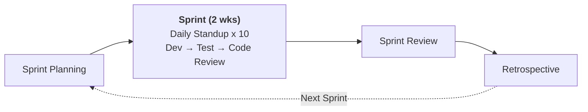

# Agile + DevOps, Sprint & GitHub Projects <Badge type="info" text="Module 1 · สัปดาห์ 1–2" />

> **Ref Book:** The DevOps Handbook — Chapter 2: The First Way: The Principles of Flow

::: danger 🚨 สถานการณ์จริง
ทีมบอกว่าทำ Agile อยู่ — มี sprint, daily standup, retrospective ครบ แต่ Task Tracker ยังไม่ถึงมือ user จริงทุก sprint เพราะ "deploy ยังต้องรอ Ops" ต้องรอ 2 สัปดาห์กว่า Ops จะ approve manual deployment นักเรียนหลายคนสับสนว่า "เราทำ Agile แล้ว ทำไมยังช้าอยู่?"
:::

> 💡 **เปรียบเทียบ:** Agile คือการวางแผนและ cook อาหารเร็วขึ้น — แต่ถ้า waiter ยังต้องรอ manager approve ทุกจาน อาหารก็ไม่ถึงลูกค้า DevOps คือการให้ waiter เอาอาหารออกได้ทันทีที่เชฟทำเสร็จ


## 🤝 Agile กับ DevOps — ต่างกันอย่างไร?

| มิติ | Agile | DevOps |
| :--- | :--- | :--- |
| **โฟกัส** | กระบวนการพัฒนา (development) | ทั้ง dev + operations + delivery |
| **ทีม** | Development team | Dev + Ops + QA รวมกัน |
| **Output** | Working software ทุก sprint | Software ที่ deploy ได้จริงบน production |
| **เครื่องมือ** | Scrum, Kanban, JIRA | CI/CD, Docker, Monitoring |
| **ความเร็ว** | ทุก 2–4 สัปดาห์ | วันละหลายครั้ง |

::: tip Agile + DevOps = ทำงานร่วมกันได้ดีมาก
Agile คือวิธีจัดการงาน — DevOps คือวิธี deliver งาน

**ทีมที่ดีที่สุดใช้ทั้งสองอย่างร่วมกัน**
:::


## 🏃 Sprint คืออะไร?

**Sprint** = ช่วงเวลาสั้นๆ (1–4 สัปดาห์) ที่ทีมมุ่งทำงานชุดหนึ่งให้สำเร็จ



### Sprint Planning — เลือกงานที่จะทำใน Sprint

1. ดู **Product Backlog** — รายการ feature/task ทั้งหมด
2. เลือกงานที่สำคัญที่สุดมาใส่ **Sprint Backlog**
3. แตก task ย่อย — แต่ละ task ใช้เวลาไม่เกิน 1 วัน

### Daily Standup — Sync ทีมทุกวัน 15 นาที

แต่ละคนตอบ 3 คำถาม:
1. เมื่อวานทำอะไร?
2. วันนี้จะทำอะไร?
3. มีอะไรติดขัดไหม?

::: warning กฎ Daily Standup
- ห้ามเกิน 15 นาที
- ไม่ใช่ meeting รายงาน — เป็น sync เร็วๆ
- ปัญหาที่ซับซ้อนนัดคุยต่อหลัง standup
:::


## 📋 Kanban Board — Visualize งานที่ค้าง

**Kanban** เป็นวิธีแสดงภาพสถานะของงานทั้งหมด:

```
┌─────────────┬──────────────┬──────────────┬─────────────┐
│   Backlog   │  In Progress │   In Review  │    Done     │
│─────────────│──────────────│──────────────│─────────────│
│ • Feature A │ • Feature B  │ • Feature C  │ • Feature D │
│ • Bug fix 1 │   (อรรถ)    │   (มิ้ง)    │ • Bug fix 2 │
│ • Task X    │              │              │             │
└─────────────┴──────────────┴──────────────┴─────────────┘
       ↑ งานรอ          ↑ กำลังทำ      ↑ รอ review    ↑ เสร็จแล้ว
```

### WIP Limit (Work In Progress Limit)

กฎสำคัญของ Kanban: **จำกัดจำนวนงานที่ทำพร้อมกัน**

> "Start finishing, stop starting"

| คอลัมน์ | WIP Limit |
| :--- | :---: |
| In Progress | สูงสุด 3 งาน |
| In Review | สูงสุด 2 งาน |

ถ้า "In Review" เต็ม → หยุดรับงานใหม่ → ไปช่วย review แทน


## 🛠️ GitHub Issues + Projects — Kanban ฟรีสำหรับทีม Dev

ใน course นี้เราใช้ **GitHub Projects** เป็น Kanban board — ไม่ต้องใช้ JIRA

### สร้าง GitHub Project

1. ไปที่ repo → แท็บ **Projects** → **New Project**
2. เลือก template: **Board** (Kanban view)
3. GitHub จะสร้าง column ให้: Todo / In Progress / Done

### สร้าง Issue ที่ดี

```markdown
Title: feat: เพิ่ม endpoint GET /api/tasks

## Description
สร้าง REST API endpoint สำหรับดึง task ทั้งหมดของ Task Tracker

## Acceptance Criteria
- [ ] GET /api/tasks ส่งคืน JSON array
- [ ] Status 200 เมื่อสำเร็จ
- [ ] Status 500 เมื่อ server error
- [ ] มี integration test ครอบคลุม

## Labels
feat, backend, wk3
```

### เชื่อม Issue กับ PR

เมื่อ PR ของคุณแก้ไข issue นั้น ให้ใส่ใน PR body:

```
Closes #12
```

เมื่อ merge PR → Issue จะปิดอัตโนมัติและย้ายไปคอลัมน์ Done 🎉


## 🔄 1 Sprint + CI/CD — ทุกอย่างเชื่อมกัน

ลองนึกภาพ Sprint 1 ของ Task Tracker ที่มี DevOps ครบ:

```
วันที่ 1: Sprint Planning
  → สร้าง Issue: "Setup Express server" (#1)
  → สร้าง Issue: "Add GET /tasks endpoint" (#2)
  → ย้ายทั้งสองเข้า "In Progress" ใน GitHub Project

วันที่ 2-3: Dev เขียน code บน branch feat/setup-server
  → push code
  → CI รัน อัตโนมัติ: lint → build → test ✅
  → สร้าง PR → teammate review

วันที่ 4: PR merge → main
  → CI/CD pipeline รัน: Test → Build image → Push GHCR → Deploy
  → app ขึ้นบน staging ใน 10 นาที ✅
  → Issue #1 ปิดอัตโนมัติ → ย้ายไป Done

วันที่ 5-10: ทำ feature อื่นต่อ รอบเดิม...

วันที่ 14: Sprint Review
  → Demo app บน staging ให้ "ลูกค้า" ดู
  → Retrospective: อะไรดี, อะไรปรับปรุง
```

::: info ใน 1 sprint อาจมี CI/CD รันมากกว่า 20 ครั้ง
ทุก push ไป feature branch → CI รัน test  
ทุก merge → CD deploy อัตโนมัติ

นี่คือ DevOps accelerate Agile
:::


## 🤖 AI Prompt Guide

::: info 💬 ถาม AI เมื่อติดปัญหา
```
"ฉันกำลังวางแผน Sprint แรกของ Task Tracker API
feature ที่ต้องทำมี: [รายการ feature]
ช่วยช่วยแตก feature เหล่านี้เป็น GitHub Issues ที่มี Acceptance Criteria ชัดเจน
และจัดลำดับว่าควรทำอะไรก่อนหลัง?"
```
:::


## ✅ Progress Check

### 🗣️ Code Review

::: details ❓ คำถาม 1: WIP Limit คืออะไร และทำไมต้องจำกัด?
**แนวคำตอบ:** WIP Limit คือจำนวนสูงสุดของงานที่ทำพร้อมกันในแต่ละคอลัมน์ จำกัดเพราะ: (1) คนทำหลายอย่างพร้อมกัน = context switching cost สูง ทำทุกอย่างช้าลง (2) งานที่ค้างใน "In Review" นานๆ = waste (Inventory) (3) บังคับให้ focus ช่วยกัน finish งาน ก่อนรับงานใหม่ — "Stop starting, start finishing"
:::

::: details ❓ คำถาม 2: ทำไม "Closes #12" ใน PR description ถึงสำคัญ?
**แนวคำตอบ:** GitHub จะปิด Issue #12 อัตโนมัติเมื่อ PR ถูก merge เป็น automation เล็กๆ ที่ลด manual work — ไม่ต้องไปปิด Issue เอง ไม่ลืม ไม่ตกหล่น นอกจากนี้ยังสร้าง traceability: ดูได้ว่า code นี้แก้ requirement อะไร — สำคัญมากเมื่อต้อง audit หรือ debug ในอนาคต
:::

::: details ❓ คำถาม 3: ถ้า In Progress มี 5 งานค้างอยู่ (เกิน WIP limit) คุณจะทำอะไรก่อน?
**แนวคำตอบ:** ตาม Kanban principle: ไม่รับงานใหม่ก่อน ช่วย review หรือ unblock งานที่ค้างก่อน วิเคราะห์ว่างานไหนใกล้เสร็จที่สุด → push ให้ Done ก่อน ลด WIP ก่อนเปิดรับงานใหม่ เพราะ throughput ของระบบถูกจำกัดโดย bottleneck ไม่ใช่โดยจำนวนงานที่เริ่ม
:::


### 📚 CLIL Vocabulary

| Technical Term | ความหมายในบริบท DevOps |
| :--- | :--- |
| `Sprint` | ช่วงเวลาสั้น 1–4 สัปดาห์ที่ทีมมุ่งทำงานชุดหนึ่งให้สำเร็จ |
| `WIP Limit` | Work In Progress Limit — จำนวนสูงสุดของงานที่ทำพร้อมกันในคอลัมน์ |
| `Backlog` | รายการงานทั้งหมดที่รอดำเนินการ เรียงตามลำดับความสำคัญ |
| `Acceptance Criteria` | เงื่อนไขที่ต้องผ่านจึงจะถือว่า feature เสร็จสมบูรณ์ |
| `Kanban` | ระบบ visualize งานผ่าน board แบบ column (Todo → Doing → Done) |
| `Throughput` | จำนวนงานที่ระบบส่งออกได้ใน 1 ช่วงเวลา |


**← ก่อนหน้า:** [Value Stream](/wk1/wk1-content3-value-stream)
**ถัดไป →** [DORA Metrics — 4 ตัวชี้วัดทีม DevOps](/wk1/wk1-content5-dora-metrics)
