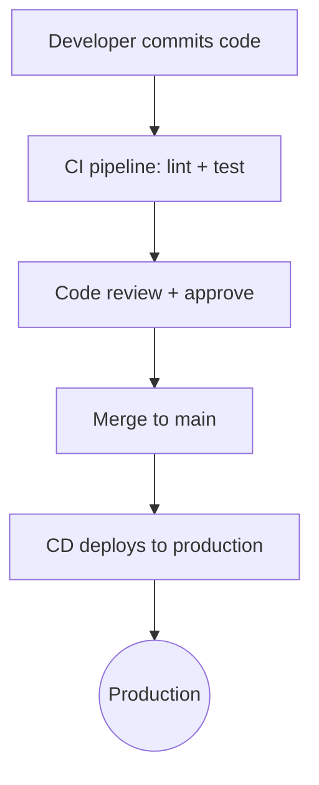
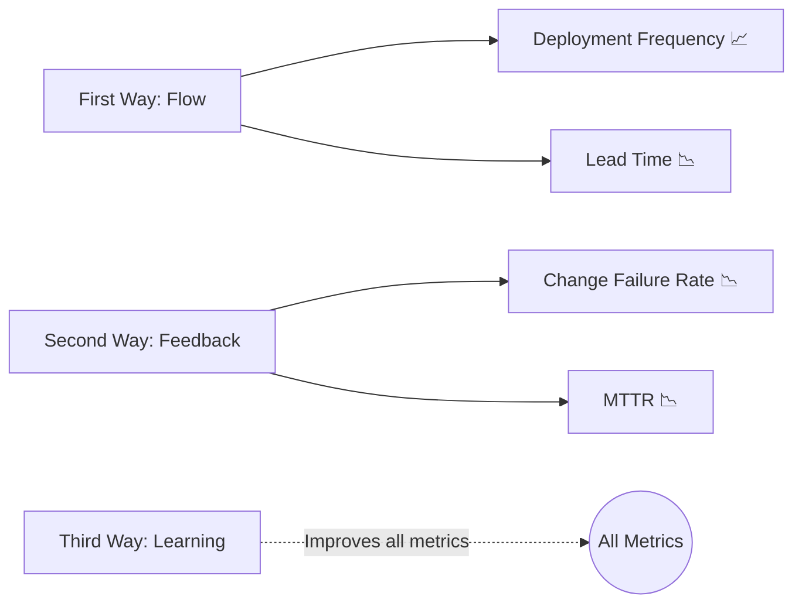

# DORA Metrics — 4 ตัวชี้วัดทีม DevOps <Badge type="info" text="Module 1 · สัปดาห์ 1–2" />

> **Ref Book:** The DevOps Handbook — Part V: Conclusion  
> **Ref:** [DORA Research Program — Google](https://dora.dev) (State of DevOps Report 2022)

::: danger 🚨 สถานการณ์จริง
ผู้จัดการถามว่า "DevOps ที่ทีมเราทำอยู่มันดีขึ้นจริงไหม?" — แต่ไม่มีใครตอบได้ด้วยตัวเลขจริง บางคนบอก "รู้สึกว่าดีขึ้น" บางคนบอก "deploy บ่อยขึ้นแต่พังบ่อยขึ้นด้วย" ปัญหาคือไม่มีตัวชี้วัดที่ตกลงกัน — DORA Metrics แก้ปัญหานี้โดยตรง
:::

> 💡 **เปรียบเทียบ:** DORA Metrics เหมือน dashboard รถยนต์ — speedometer (DF), trip time (LTC), warning light (CFR), และ repair time (MTTR) ไม่มี dashboard คนขับก็ขับได้ แต่รู้ได้ยากว่าเครื่องจะพังเมื่อไร


## 🔬 DORA คืออะไร?

**DORA** (DevOps Research and Assessment) คือโปรแกรมวิจัยของ Google ที่ศึกษาทีม DevOps กว่า **32,000+ ทีม** ทั่วโลกเป็นเวลา **6 ปี**

ผลการวิจัย: ทีม Elite DevOps วัดผล 4 metrics หลัก และมีค่าสูงกว่าทีมทั่วไปอย่างมีนัยสำคัญ

::: warning จำ 4 metrics นี้ — ถามทุก DevOps interview!
DF · LTC · CFR · MTTR
:::


## 📊 Metric 1: Deployment Frequency (DF)

> **ทีม deploy software บ่อยแค่ไหน?**

Deploy บ่อย = batch เล็ก = ความเสี่ยงต่อครั้ง**ต่ำ**

| ระดับ | Deploy Frequency |
| :--- | :--- |
| 🏆 **Elite** | หลายครั้งต่อวัน |
| 🥈 High | สัปดาห์ละครั้ง ถึงเดือนละครั้ง |
| 🥉 Medium | เดือนละครั้ง ถึงทุก 6 เดือน |
| ❌ Low | ทุก 6 เดือน หรือนานกว่านั้น |

**วิธีเพิ่ม DF สำหรับ Task Tracker:**

```bash
# ดู deploy history ใน GitHub Actions
# ทุก push to main = 1 deploy ✅
git log --oneline origin/main | head -20

# ถ้า deploy ถี่เกิน → ดูที่ GitHub Actions tab
# ต้องเห็น workflow run ทุกครั้งที่ push
```


## 📊 Metric 2: Lead Time for Changes (LTC)

> **ตั้งแต่ code commit จนถึง production ใช้เวลากี่นาที?**



| ระดับ | Lead Time |
| :--- | :--- |
| 🏆 **Elite** | น้อยกว่า 1 ชั่วโมง |
| 🥈 High | 1 วัน ถึง 1 สัปดาห์ |
| 🥉 Medium | 1 สัปดาห์ ถึง 1 เดือน |
| ❌ Low | มากกว่า 1 เดือน |

**วิธีวัด LTC ใน Task Tracker:**

```bash
# วัดเวลาจาก commit timestamp → deployment timestamp
# ดูจาก GitHub Actions: created_at → completed_at ของ CD job
git log --format="%H %ai %s" | head -5
# ↑ เวลา commit → เทียบกับเวลา Render deploy สำเร็จ
```


## 📊 Metric 3: Change Failure Rate (CFR)

> **Deploy แต่ละครั้ง มีกี่ % ที่ทำให้ระบบมีปัญหา?**

```
deploy 100 ครั้ง → มีปัญหา 5 ครั้ง
Change Failure Rate = 5%
```

| ระดับ | Change Failure Rate |
| :--- | :--- |
| 🏆 **Elite** | 0%–15% |
| 🥈 High | 16%–30% |
| ❌ Medium/Low | > 30% |

"มีปัญหา" หมายถึง: ระบบล่ม, degraded performance, ต้องทำ hotfix, rollback

**วิธีลด CFR:**

```bash
# เพิ่ม test coverage ก่อน deploy
npm run test:coverage
# coverage < 60% → ไม่ควร deploy!

# ใช้ automated security scanning
npm audit
# ถ้ามี critical vulnerability → fix ก่อน merge
```


## 📊 Metric 4: Mean Time to Restore (MTTR)

> **เมื่อระบบมีปัญหา กู้คืนได้เร็วแค่ไหน?**

```
System fails at 14:00
Team detects at 14:05  ← ถ้ามี monitoring ดี (UptimeRobot)
Team diagnoses at 14:15
System restored at 14:35

MTTR = 35 นาที ✅ (Elite level)
```

| ระดับ | MTTR |
| :--- | :--- |
| 🏆 **Elite** | น้อยกว่า 1 ชั่วโมง |
| 🥈 High | น้อยกว่า 1 วัน |
| 🥉 Medium | 1 วัน ถึง 1 สัปดาห์ |
| ❌ Low | มากกว่า 6 เดือน |

**วิธีลด MTTR — ใน Task Tracker:**

```bash
# Rollback ใน 1 คำสั่ง (ถ้ามี CD ที่ดี)
# Render: กด Rollback ใน dashboard
# หรือ revert commit แล้ว push

git revert HEAD       # สร้าง commit ที่ undone การเปลี่ยนแปลงล่าสุด
git push origin main  # CD จะ deploy version เดิมทันที

# ผล: ระบบกลับมาภายใน 5 นาที ✅
```


## 🏆 Elite vs Low Performer

จากงานวิจัย DORA 2022:

| Metric | Elite | Low |
| :--- | :---: | :---: |
| Deployment Frequency | หลาย**ครั้งต่อวัน** | **ทุก 6 เดือน** หรือนานกว่า |
| Lead Time for Changes | < **1 ชั่วโมง** | > **6 เดือน** |
| Change Failure Rate | **0%–15%** | > **30%** |
| MTTR | < **1 ชั่วโมง** | > **6 เดือน** |

::: info ตัวเลขที่น่าตะลึง
Elite performers deploy **973 เท่า** บ่อยกว่า Low performers  
และมี MTTR เร็วกว่า **6,570 เท่า**

แต่ Change Failure Rate ของ Elite กลับ**ต่ำกว่า** — deploy บ่อยไม่ได้แปลว่าพังบ่อย
:::


## 📈 DORA กับโปรเจกต์ Task Tracker ของคุณ

ใน Final exam นักเรียนจะวัด DORA metrics ของโปรเจกต์ตัวเองจริงๆ:

| Metric | วัดจากที่ไหน |
| :--- | :--- |
| Deployment Frequency | GitHub Actions run history |
| Lead Time for Changes | เวลาระหว่าง commit → deploy job เสร็จ |
| Change Failure Rate | PR ที่ต้อง revert / hotfix branch |
| MTTR | เวลาตั้งแต่ alert UptimeRobot → fix deploy |


## 🔗 DORA กับ Three Ways

DORA metrics วัดผลของ Three Ways โดยตรง:




## 🤖 AI Prompt Guide

::: info 💬 ถาม AI เมื่อติดปัญหา
```
"Task Tracker ของฉัน deploy frequency สูง แต่ change failure rate ก็สูงด้วย (20%)
ช่วยวิเคราะห์ว่่าสาเหตุที่เป็นไปได้คืออะไร
และ DevOps practice ไหนที่จะช่วยลด CFR โดยไม่ลด deploy frequency?"
```
:::


## ✅ Progress Check

### 🗣️ Code Review

::: details ❓ คำถาม 1: ทำไม Elite team ถึง deploy บ่อยกว่า Low แต่ Change Failure Rate กลับต่ำกว่า?
**แนวคำตอบ:** เพราะ Elite team deploy ด้วย batch เล็ก — แต่ละ deploy มี change น้อย → ถ้าพังรู้ทันทีว่าเพราะอะไร แก้ง่าย Low team deploy นานๆ ครั้ง batch ใหญ่ — เมื่อพัง ยากมากที่จะรู้ว่า change ไหนทำให้พัง นอกจากนี้ Elite team มี automated test ที่จับ bug ก่อน production
:::

::: details ❓ คำถาม 2: MTTR กับ CFR ต่างกันอย่างไร และทีม DevOps ควร optimize อะไรก่อน?
**แนวคำตอบ:** CFR = การ**ป้องกัน**ปัญหา (ลด % ที่พัง), MTTR = การ**แก้ไข**ปัญหาเมื่อเกิดขึ้น ควร optimize ทั้งสอง แต่ถ้าต้องเลือก: MTTR ก่อน — เพราะ production จะมีปัญหาแน่นอนสักวัน ถ้า restore เร็ว ผลกระทบต่อ user น้อย แล้วค่อยใช้ข้อมูลจาก incident มา improve เพื่อลด CFR
:::

::: details ❓ คำถาม 3: ถ้า Task Tracker ของคุณ deploy frequency ต่ำมาก (เดือนละครั้ง) จะแก้อย่างไร?
**แนวคำตอบ:** วิเคราะห์ก่อนว่าทำไมถึงช้า — มักมาจาก: (1) ไม่มี CI/CD pipeline → สร้าง GitHub Actions workflow (2) Manual approval process → ตั้ง automated quality gate (3) Feature branch อยู่นานเกินไป → ใช้ trunk-based development หรือ feature flag (4) กลัวพัง → เพิ่ม test coverage ก่อน แล้วค่อย deploy บ่อยขึ้น
:::


### 📚 CLIL Vocabulary

| Technical Term | ความหมายในบริบท DevOps |
| :--- | :--- |
| `DORA` | DevOps Research and Assessment — โปรแกรมวิจัย Google วัด performance ทีม DevOps |
| `Deployment Frequency` | ความถี่ในการ deploy software สู่ production |
| `Lead Time for Changes` | เวลาตั้งแต่ commit code จนถึง running บน production |
| `Change Failure Rate` | % ของ deployment ที่ทำให้เกิดปัญหาบน production |
| `MTTR` | Mean Time to Restore — เวลาเฉลี่ยในการ restore service หลังเกิดปัญหา |
| `Trunk-based development` | รูปแบบ branching ที่ทุกคน merge บ่อยๆ โดยตรงกับ main branch |
| `Feature flag` | ฟีเจอร์ที่ deploy แต่ซ่อนไว้ เปิดได้ทีหลังโดยไม่ต้อง deploy ใหม่ |


**← ก่อนหน้า:** [Agile + DevOps](/wk1/wk1-content4-agile-devops)
**ถัดไป →** [Lab: ตั้งค่า Dev Environment](/wk1/wk1-lab1-env-setup)
