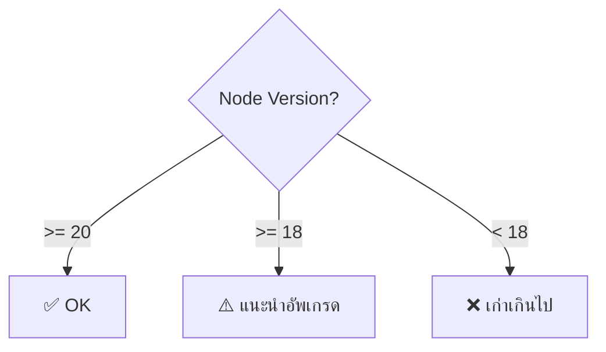

# Shell Script — Variables, Loops & Functions <Badge type="info" text="Module 2 · สัปดาห์ 3–4" />

> **Ref Book:** The Linux Command Line — Chapter 24–28


## 🤖 Shell Script คืออะไร?

Shell Script คือไฟล์ข้อความที่เก็บชุดคำสั่ง Linux เอาไว้ — รันทีเดียวได้หลายคำสั่งต่อเนื่องกัน

ในสายงาน DevOps script ใช้ทำ:
- ตั้งค่า environment อัตโนมัติ
- Backup ข้อมูลตามเวลา
- Health check ระบบ
- Deploy application


## 🚀 เริ่มต้นเขียน Script

### Shebang — บรรทัดแรกสำคัญที่สุด

```bash
#!/bin/bash
```

บรรทัดนี้บอก OS ว่าให้ใช้ `/bin/bash` รัน script นี้ — **ต้องมีทุกไฟล์**

### สร้างและรัน Script แรก

```bash
# สร้างไฟล์
touch hello.sh

# เขียน script
cat > hello.sh << 'EOF'
#!/bin/bash
echo "Hello, DevOps!"
echo "วันนี้คือ: $(date)"
echo "รันโดย user: $USER"
EOF

# ให้สิทธิ์ execute
chmod +x hello.sh

# รัน
./hello.sh
```

ผลลัพธ์:
```
Hello, DevOps!
วันนี้คือ: Thu Apr 17 09:00:00 +07 2025
รันโดย user: devops
```


## 📦 Variables

```bash
#!/bin/bash

# กำหนด variable (ไม่มี $ ตอนกำหนด, มี $ ตอนใช้)
NAME="Task Tracker"
VERSION="1.0.0"
PORT=3000

# ใช้ variable
echo "App: $NAME"
echo "Version: ${VERSION}"        # ใช้ {} เมื่อมีตัวอักษรต่อ
echo "URL: http://localhost:${PORT}/api"

# Command substitution — เก็บ output ของคำสั่งใน variable
CURRENT_DATE=$(date +%Y-%m-%d)
NODE_VERSION=$(node --version)
COMMIT_HASH=$(git rev-parse --short HEAD)

echo "Deploy date: $CURRENT_DATE"
echo "Node: $NODE_VERSION"
echo "Git: $COMMIT_HASH"
```

### Environment Variables

```bash
# อ่าน env var
echo $HOME
echo $PATH
echo $USER

# ตั้ง env var ชั่วคราว (เฉพาะ session)
export APP_ENV="production"
export DB_HOST="localhost"

# อ่านจาก .env file
source .env        # หรือ
. .env
```


## 📥 รับ Input จากผู้ใช้

### Positional Parameters (Arguments)

```bash
#!/bin/bash
# รัน: ./deploy.sh my-app production

APP_NAME=$1       # argument ที่ 1
ENVIRONMENT=$2    # argument ที่ 2

echo "Deploying $APP_NAME to $ENVIRONMENT..."

# ตรวจสอบว่าใส่ argument ครบ
if [ -z "$1" ]; then
  echo "Usage: $0 <app-name> <environment>"
  exit 1
fi
```

| Variable | ความหมาย |
| :---: | :--- |
| `$0` | ชื่อ script เอง |
| `$1`, `$2`, ... | argument ที่ 1, 2, ... |
| `$#` | จำนวน argument ทั้งหมด |
| `$@` | argument ทุกตัวเป็น array |
| `$?` | exit code ของคำสั่งก่อนหน้า |

### Interactive Input

```bash
#!/bin/bash
read -p "ชื่อโปรเจกต์: " PROJECT_NAME
read -p "Port ที่ต้องการ [3000]: " PORT
PORT=${PORT:-3000}    # ถ้าไม่ใส่ ใช้ค่า default 3000

echo "สร้างโปรเจกต์: $PROJECT_NAME บน port $PORT"
```


## 🔀 Conditionals



```bash
#!/bin/bash

# if-elif-else
NODE_VERSION=$(node --version | cut -d'v' -f2 | cut -d'.' -f1)

if [ "$NODE_VERSION" -ge 20 ]; then
  echo "✅ Node.js version OK: $NODE_VERSION"
elif [ "$NODE_VERSION" -ge 18 ]; then
  echo "⚠️  Node.js 18 — แนะนำอัพเกรดเป็น 20"
else
  echo "❌ Node.js เก่าเกิน กรุณาอัพเดต"
  exit 1
fi

# ตรวจสอบไฟล์/directory
if [ -f ".env" ]; then
  echo "พบ .env file"
fi

if [ -d "node_modules" ]; then
  echo "node_modules มีอยู่แล้ว"
else
  npm install
fi

# ตรวจสอบคำสั่งว่ามีในระบบ
if command -v docker &> /dev/null; then
  echo "Docker พร้อมใช้งาน"
else
  echo "Docker ยังไม่ได้ติดตั้ง"
  exit 1
fi
```

### Comparison Operators

| Operator | ความหมาย | ตัวอย่าง |
| :---: | :--- | :--- |
| `-eq` | เท่ากัน (ตัวเลข) | `[ $a -eq $b ]` |
| `-ne` | ไม่เท่ากัน | `[ $a -ne 0 ]` |
| `-gt` | มากกว่า | `[ $count -gt 10 ]` |
| `-lt` | น้อยกว่า | `[ $p -lt 100 ]` |
| `-z` | string ว่างเปล่า | `[ -z "$NAME" ]` |
| `-n` | string ไม่ว่าง | `[ -n "$NAME" ]` |
| `=` | string เท่ากัน | `[ "$ENV" = "prod" ]` |
| `-f` | เป็นไฟล์ | `[ -f "app.log" ]` |
| `-d` | เป็น directory | `[ -d "src" ]` |


## 🔄 Loops

```bash
#!/bin/bash

# for loop — วนลิสต์
SERVICES=("api" "db" "cache")
for SERVICE in "${SERVICES[@]}"; do
  echo "Checking $SERVICE..."
  docker ps | grep "$SERVICE" || echo "$SERVICE is not running!"
done

# for loop — วนตามช่วงตัวเลข
for i in {1..5}; do
  echo "Attempt $i..."
done

# while loop — วนจนกว่าเงื่อนไขจะเป็นจริง
COUNT=0
while [ $COUNT -lt 3 ]; do
  echo "Retry $COUNT..."
  COUNT=$((COUNT + 1))
  sleep 2
done

# วน line-by-line จาก file
while IFS= read -r line; do
  echo "Processing: $line"
done < servers.txt
```


## 🛠️ Functions

```bash
#!/bin/bash

# นิยาม function
check_tool() {
  local TOOL=$1    # local = variable ใช้แค่ใน function
  if command -v "$TOOL" &> /dev/null; then
    echo "  ✅ $TOOL"
    return 0       # success
  else
    echo "  ❌ $TOOL ยังไม่ได้ติดตั้ง"
    return 1       # failure
  fi
}

log() {
  local LEVEL=$1
  local MESSAGE=$2
  echo "[$(date '+%H:%M:%S')] [$LEVEL] $MESSAGE"
}

# เรียกใช้ function
log "INFO" "เริ่มตรวจสอบ environment..."
check_tool "git"
check_tool "node"
check_tool "docker"

# เก็บ return value
check_tool "node"
if [ $? -eq 0 ]; then
  log "INFO" "ทุก tool พร้อมใช้งาน"
fi
```


## 🚪 Exit Codes

```bash
#!/bin/bash

# exit 0 = success, exit 1 (หรือ non-zero) = failure
npm test
if [ $? -ne 0 ]; then
  echo "❌ Tests failed! ยกเลิก deploy"
  exit 1
fi

# set -e : หยุดทันทีเมื่อมี error (แนะนำใช้ทุก script)
set -e

# set -u : error เมื่อใช้ variable ที่ไม่ได้ประกาศ
set -u

# ใช้ทั้งคู่พร้อมกัน (best practice)
set -eu
```


## 🏗️ Script จริง: Environment Setup

ตัวอย่าง script ที่จะใช้ใน Lab:

```bash
#!/bin/bash
set -eu

# ─── Config ────────────────────────────────
PROJECT_NAME=${1:-"my-app"}
LOG_FILE="setup-$(date +%Y%m%d).log"

# ─── Functions ─────────────────────────────
log() { echo "[$(date '+%H:%M:%S')] $1" | tee -a "$LOG_FILE"; }

check_tool() {
  if ! command -v "$1" &> /dev/null; then
    log "❌ ต้องการ $1 แต่ยังไม่ได้ติดตั้ง"
    exit 1
  fi
  log "✅ $1 พร้อมใช้งาน"
}

# ─── Main ──────────────────────────────────
log "🚀 เริ่มสร้างโปรเจกต์: $PROJECT_NAME"

# ตรวจสอบ tools
check_tool "git"
check_tool "node"
check_tool "docker"

# สร้าง folder structure
mkdir -p "$PROJECT_NAME"/{src,tests,docs}
touch "$PROJECT_NAME"/{README.md,.env.example,.gitignore}

log "✅ สร้าง $PROJECT_NAME เสร็จแล้ว!"
```


## 💡 สรุป

::: info สิ่งที่ต้องจำ
| หัวข้อ | คำสำคัญ |
| :--- | :--- |
| Shebang | `#!/bin/bash` บรรทัดแรกเสมอ |
| Variable | `NAME="value"` / `$NAME` / `${NAME}` |
| Argument | `$1`, `$2`, `$#`, `$@`, `$?` |
| Conditional | `if [ condition ]; then ... fi` |
| Loop | `for x in list`, `while [ cond ]` |
| Function | `name() { local var=...; }` |
| Exit code | `exit 0` = OK, `exit 1` = ERROR |
| Best practice | `set -eu` ทุก script |
:::


**← ก่อนหน้า:** [Linux CLI](/wk2/wk2-content1-linux-cli)  
**ถัดไป →** [Text Processing: grep, sed, awk](/wk2/wk2-content3-text-processing)
