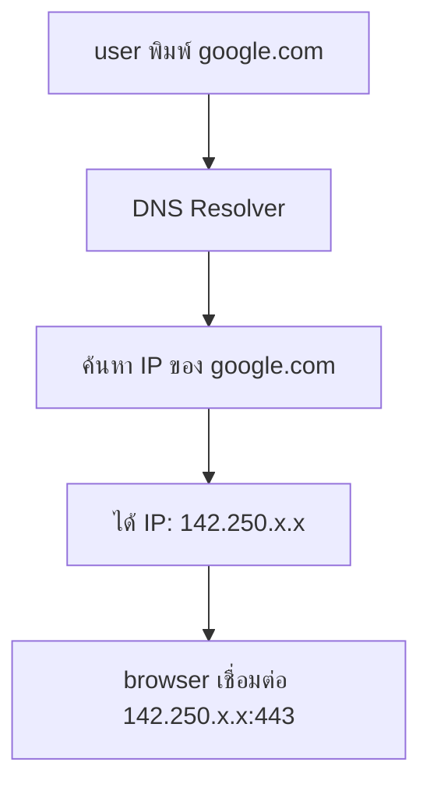
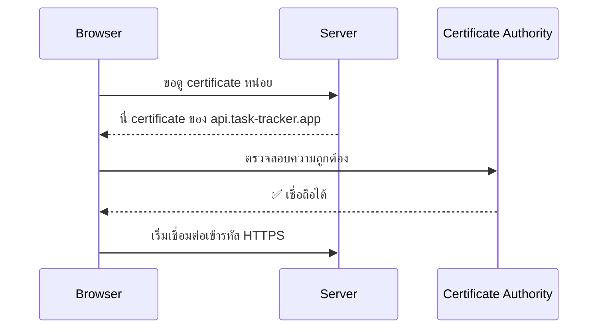
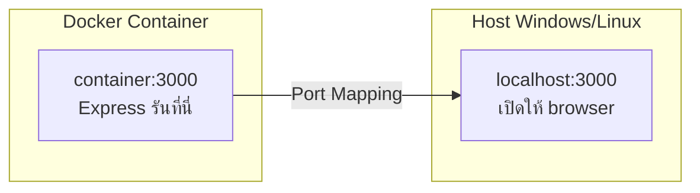

# Networking for DevOps <Badge type="info" text="Module 2 · สัปดาห์ 3–4" />

> **Ref Book:** The Linux Command Line — Chapter 16


## 🌐 ทำไม DevOps ต้องรู้ Networking?

เมื่อ deploy app ขึ้น production แล้ว user เชื่อมต่อไม่ได้ — ต้อง debug เองจาก terminal

```bash
# คำถามที่ต้องตอบได้เสมอ
"App รันอยู่ไหม?"           → curl / ps aux
"Port เปิดอยู่ไหม?"         → ss / netstat
"DNS resolve ถูกไหม?"       → dig / nslookup
"Path ผ่าน network ได้ไหม?" → ping / traceroute
```


## 🔢 IP Address & Port

### IP Address

ที่อยู่ของ device บน network — ใช้ระบุตำแหน่งของ server

```
192.168.1.100:3000
───────────── ────
      │         └── Port: ระบุ "ประตู" ที่ service รับอยู่
      └── IP: ระบุตัว server
```

| IP Range | ชื่อ | ใช้ที่ไหน |
| :--- | :--- | :--- |
| `127.0.0.1` | localhost / loopback | ตัวเอง |
| `192.168.x.x` | private network | LAN บ้าน/ออฟฟิศ |
| `10.x.x.x` | private network | Docker / VPN |
| `0.0.0.0` | all interfaces | bind service ให้รับทุก IP |

### Port ที่ DevOps ต้องรู้

| Port | Protocol | ใช้ทำอะไร |
| :---: | :--- | :--- |
| **22** | SSH | เชื่อมต่อ server จากระยะไกล |
| **80** | HTTP | web traffic ไม่เข้ารหัส |
| **443** | HTTPS | web traffic เข้ารหัส (TLS) |
| **3000** | Express/Node | dev server ทั่วไป |
| **5432** | PostgreSQL | database |
| **3306** | MySQL | database |
| **6379** | Redis | cache / message queue |
| **8080** | HTTP alt | reverse proxy, Jenkins |

```bash
# ดู port ที่กำลัง listen อยู่บนเครื่อง
ss -tlnp              # modern (แนะนำ)
netstat -tlnp         # classic

# ตัวอย่าง output
# tcp  0.0.0.0:3000   LISTEN  1234/node
```


## 🔤 DNS — Domain Name System

DNS แปลง **ชื่อ domain** → **IP address** เหมือนสมุดโทรศัพท์ของ Internet



```bash
# ค้นหา IP ของ domain
dig google.com
dig api.task-tracker.app

# ดูแค่ IP (ง่ายกว่า)
dig +short google.com
nslookup google.com

# ตัวอย่างผลลัพธ์
# google.com. 300 IN A 142.250.68.68

# ดู DNS record ประเภทต่างๆ
dig google.com MX    # Mail server
dig google.com TXT   # Text records (SPF, verification)
dig google.com NS    # Name servers

# /etc/hosts — override DNS บนเครื่องตัวเอง
cat /etc/hosts
# 127.0.0.1  localhost
# 127.0.0.1  api.task-tracker.dev   ← เพิ่มเองได้
```


## 🔒 HTTP vs HTTPS

| | HTTP | HTTPS |
| :--- | :--- | :--- |
| **Port** | 80 | 443 |
| **เข้ารหัส** | ❌ ไม่มี | ✅ TLS encryption |
| **ความปลอดภัย** | ข้อมูลถูกดักอ่านได้ | ปลอดภัย |
| **Production** | ❌ ห้ามใช้ | ✅ บังคับใช้ |
| **Certificate** | ไม่ต้องการ | ต้องมี SSL cert |

### SSL/TLS Certificate

Certificate คือ "ใบรับรอง" ที่พิสูจน์ว่า website เป็นของใคร



**Let's Encrypt** — CA ฟรีที่ใช้ได้กับทุก domain (Render จัดการให้อัตโนมัติ)


## 🛠️ curl — ทดสอบ API จาก Terminal

`curl` คือเครื่องมือทำ HTTP request จาก command line — ใช้ทดสอบ API โดยไม่ต้องเปิด browser

```bash
# GET request พื้นฐาน
curl http://localhost:3000/api/tasks
curl https://api.task-tracker.app/tasks

# แสดง HTTP headers ด้วย
curl -i http://localhost:3000/api/tasks

# แสดง verbose (debug ทุกอย่าง)
curl -v https://api.task-tracker.app/tasks

# POST — ส่ง JSON body
curl -X POST http://localhost:3000/api/tasks \
  -H "Content-Type: application/json" \
  -d '{"title": "เรียน DevOps", "done": false}'

# POST พร้อม Authentication token
curl -X POST http://localhost:3000/api/tasks \
  -H "Content-Type: application/json" \
  -H "Authorization: Bearer eyJhbGci..." \
  -d '{"title": "task ใหม่"}'

# PUT — อัพเดต resource
curl -X PUT http://localhost:3000/api/tasks/1 \
  -H "Content-Type: application/json" \
  -d '{"done": true}'

# DELETE
curl -X DELETE http://localhost:3000/api/tasks/1

# ดูแค่ HTTP status code
curl -o /dev/null -s -w "%{http_code}" http://localhost:3000/health
# 200

# ดาวน์โหลดไฟล์
curl -O https://example.com/file.zip
curl -o output.zip https://example.com/file.zip
```

### ใช้ curl ใน Health Check Script

```bash
#!/bin/bash
HEALTH_URL="http://localhost:3000/health"
STATUS=$(curl -o /dev/null -s -w "%{http_code}" "$HEALTH_URL")

if [ "$STATUS" = "200" ]; then
  echo "✅ Service is healthy"
else
  echo "❌ Service returned $STATUS"
  exit 1
fi
```


## 🏓 ping & traceroute — Debug Network

```bash
# ping — ตรวจสอบว่าเชื่อมต่อถึง host ได้ไหม
ping google.com        # ส่ง ICMP packet ไปเรื่อยๆ
ping -c 4 google.com   # ส่งแค่ 4 ครั้ง

# traceroute — ดูเส้นทาง packet ผ่าน network
traceroute google.com
# 1. 192.168.1.1 (router บ้าน)
# 2. 10.1.1.1 (ISP gateway)
# 3. 203.x.x.x (backbone)
# ...
# 12. 142.250.68.68 (google.com)

# ss — ดู network connections ที่ active
ss -tp            # TCP connections พร้อมชื่อ process
ss -tlnp          # Listening TCP ports
```


## 🐳 Networking ใน Docker

```bash
# Docker สร้าง virtual network ให้ container คุยกัน
docker network ls

# Container ใช้ชื่อ service แทน IP ได้ใน docker-compose
# ใน docker-compose.yml:
# api service เรียก database ด้วย hostname "db" ได้เลย

# ดู IP ของ container
docker inspect <container> | grep IPAddress

# ทดสอบ connectivity ระหว่าง container
docker exec -it api-container curl http://db:5432
```

::: info Port Mapping ใน Docker

กำหนดใน docker-compose: `ports: - "3000:3000"`
:::


## 💡 สรุป

::: info Network commands ที่ต้องใช้ได้ก่อนเรียน Module 4 (Docker)
| คำสั่ง | ใช้ทำอะไร |
| :--- | :--- |
| `curl -X GET/POST` | ทดสอบ REST API |
| `ping hostname` | ตรวจ connectivity |
| `dig domain` | ตรวจ DNS |
| `ss -tlnp` | ดู port ที่เปิดอยู่ |
| `curl -s -w "%{http_code}"` | ตรวจ HTTP status ใน script |
:::


**← ก่อนหน้า:** [Text Processing: grep, sed, awk](/wk2/wk2-content3-text-processing)  
**ถัดไป →** [Lab: Automation Script](/wk2/wk2-lab1-automation)
