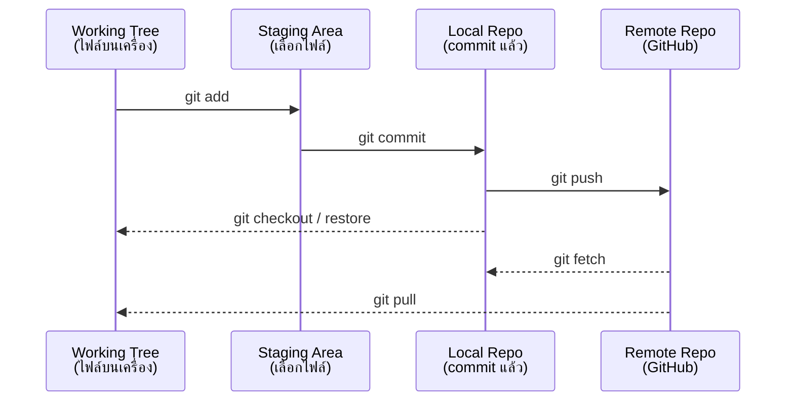

# Git Fundamentals & Conventional Commits <Badge type="info" text="Module 3 · สัปดาห์ 5–6" />

> **Ref Book:** Pro Git — Chapter 1–2


## 🤔 ทำไม DevOps ต้องใช้ Version Control?

ลองนึกภาพทีม 3 คนเขียน code ไฟล์เดียวกัน แล้วส่งกันผ่าน LINE:

```
อรรถ: "นี่ app_v2_final.js"
มิ้ง: "อ้าว ฉันแก้ app_v2_final_edit.js ไปแล้ว"
โอม: "ของฉันชื่อ app_v2_final_NEW.js"
```

นี่คือปัญหาที่ Git แก้ — **ทุกคนทำงานบน code เดียวกัน ไม่มี conflict ไม่มีไฟล์ซ้ำ**

Git ยังทำให้:
- ย้อนดู code เวอร์ชันเก่าได้ทุก commit
- รู้ว่าใครเปลี่ยนอะไร เมื่อไร ทำไม
- ทดลอง feature ใหม่บน branch โดยไม่กระทบ code หลัก


## 🗄️ แนวคิดหลักใน Git



| ส่วน | หน้าที่ |
| :--- | :--- |
| **Working Tree** | ไฟล์จริงบนเครื่องที่คุณแก้ไข |
| **Staging Area** | พื้นที่เตรียมไฟล์ก่อน commit (index) |
| **Local Repository** | ประวัติ commit ทั้งหมดบนเครื่อง |
| **Remote Repository** | repo บน GitHub/GitLab |


## 🚀 เริ่มต้นใช้ Git

### สร้าง Repository ใหม่

```bash
# สร้าง repo ในโฟลเดอร์ปัจจุบัน
mkdir task-tracker && cd task-tracker
git init

# ดูสถานะ
git status
# On branch main
# No commits yet
# nothing to commit
```

### Clone จาก GitHub

```bash
# clone repo มาทำงาน
git clone https://github.com/username/task-tracker.git
git clone git@github.com:username/task-tracker.git  # ใช้ SSH (แนะนำ)

# clone แล้วเข้าโฟลเดอร์
cd task-tracker
```


## 📝 Workflow พื้นฐาน: add → commit

```bash
# 1. ดูสถานะไฟล์
git status

# 2. เพิ่มไฟล์ที่ต้องการ commit ไปยัง Staging
git add src/index.ts             # เพิ่มไฟล์เดี่ยว
git add src/                     # เพิ่มทั้ง folder
git add .                        # เพิ่มทุกไฟล์ที่เปลี่ยน (ระวัง!)

# 3. ดูว่าจะ commit อะไร
git status
git diff --staged                # ดูความต่างของไฟล์ใน staging

# 4. Commit
git commit -m "feat: add GET /tasks endpoint"

# 5. ดู history
git log --oneline
git log --oneline --graph        # แสดง branch graph
```


## 🔍 ดูประวัติและความเปลี่ยนแปลง

```bash
# git log — ดู commit history
git log                          # แสดงทั้งหมด
git log --oneline                # สั้นๆ ทีละบรรทัด
git log --oneline -10            # แค่ 10 commit ล่าสุด
git log --oneline --graph --all  # ดู branch ทั้งหมด

# ตัวอย่าง output
# a3f1d2c feat: add DELETE /tasks/:id endpoint
# 8b2e4a1 fix: handle empty task list response
# 1c9d7e3 feat: add GET /tasks endpoint
# 4a5f2b0 feat: initial Express setup

# git diff — ดูความแตกต่าง
git diff                         # working tree vs staging
git diff --staged                # staging vs last commit
git diff HEAD~1 HEAD             # commit ล่าสุด vs ก่อนหน้า
git diff main..feature/tasks     # เปรียบเทียบ 2 branch

# git show — ดูรายละเอียด commit
git show a3f1d2c                 # ดู commit นั้นว่าเปลี่ยนอะไร
```


## ↩️ Undoing Changes

```bash
# ━━━ ยังไม่ได้ add ━━━━━━━━━━━━━━━━━━━━━━━━━━
# ยกเลิกการแก้ไขไฟล์ใน working tree
git restore src/index.ts         # คืนไฟล์กลับเป็น version ล่าสุด

# ━━━ add ไปแล้ว แต่ยังไม่ commit ━━━━━━━━━━━━
# เอาไฟล์ออกจาก staging (ไฟล์ยังมีการแก้ไขอยู่)
git restore --staged src/index.ts

# ━━━ commit ไปแล้ว ━━━━━━━━━━━━━━━━━━━━━━━━━
# แก้ commit ล่าสุด (เพิ่มไฟล์ที่ลืม หรือแก้ message)
git commit --amend -m "feat: add GET /tasks endpoint with pagination"

# สร้าง commit ใหม่ที่ "ลบล้าง" commit เก่า (ปลอดภัยกว่า reset)
git revert a3f1d2c

# ⚠️ อันตราย: ย้อน HEAD กลับ (ลบ commit ออกจาก history)
git reset --soft HEAD~1          # ย้อน 1 commit แต่คง staging
git reset --hard HEAD~1          # ย้อน 1 commit และลบการแก้ไขทั้งหมด
```

::: warning เลือก undo ให้ถูก
| สถานการณ์ | คำสั่ง |
| :--- | :--- |
| แก้ไฟล์แต่อยากคืน | `git restore <file>` |
| add แล้วอยาก unstage | `git restore --staged <file>` |
| commit ผิด message | `git commit --amend` |
| ต้องการลบ commit (ยังไม่ push) | `git reset --soft HEAD~1` |
| ต้องการลบ commit (push แล้ว) | `git revert <hash>` |
:::


## 🙈 .gitignore — ไฟล์ที่ไม่ควร Commit

```bash
# .gitignore — สร้างไว้ root ของ repo
cat > .gitignore << 'EOF'
# Dependencies
node_modules/

# Environment & Secrets
.env
.env.local
.env.production

# Build output
dist/
build/
*.js.map

# OS files
.DS_Store
Thumbs.db

# Logs
*.log
logs/

# Editor
.vscode/settings.json
.idea/
EOF
```

::: tip ใช้ gitignore templates
```bash
# ดาวน์โหลด .gitignore สำเร็จรูปสำหรับ Node.js
curl -o .gitignore https://www.toptal.com/developers/gitignore/api/node
```
หรือไปที่ [gitignore.io](https://www.toptal.com/developers/gitignore) เลือก: Node, Windows, macOS
:::


## 📝 Conventional Commits — มาตรฐาน Commit Message

Commit message ที่ดีต้องบอกได้ว่า **"ทำอะไร"** ไม่ใช่แค่ **"แก้อะไร"**

### Format

```
<type>(<scope>): <description>

[optional body]

[optional footer]
```

### Types ที่ใช้บ่อย

| Type | ใช้เมื่อ | ตัวอย่าง |
| :--- | :--- | :--- |
| `feat` | เพิ่ม feature ใหม่ | `feat: add POST /tasks endpoint` |
| `fix` | แก้ bug | `fix: handle null taskId in GET /tasks/:id` |
| `docs` | แก้ documentation | `docs: update README with API examples` |
| `chore` | งาน maintenance | `chore: update dependencies` |
| `refactor` | refactor โดยไม่แก้ feature | `refactor: extract taskService from controller` |
| `test` | เพิ่ม/แก้ test | `test: add unit test for taskService.create` |
| `ci` | แก้ CI/CD config | `ci: add lint step to GitHub Actions` |
| `style` | แก้ formatting เท่านั้น | `style: format with prettier` |

### ตัวอย่างที่ดี vs ไม่ดี

```bash
# ❌ ไม่ดี — ไม่รู้ว่าทำอะไร
git commit -m "fix bug"
git commit -m "update"
git commit -m "asdfgh"

# ✅ ดี — อ่านแล้วเข้าใจทันที
git commit -m "feat: add GET /tasks endpoint returning all tasks"
git commit -m "fix: return 404 when task not found instead of 500"
git commit -m "docs: add curl examples to README"
git commit -m "chore: add .gitignore for Node.js project"
```

::: tip Scope — ระบุส่วนที่แก้
```bash
feat(api): add pagination to GET /tasks
fix(auth): handle expired JWT token correctly
test(tasks): add integration test for DELETE endpoint
```
:::


## 💡 สรุป

::: info คำสั่งที่ต้องจำให้ได้ก่อนเรียน GitHub Collaboration
```bash
git init / git clone         # เริ่ม repo
git status                   # ดูสถานะ
git add . / git add <file>   # stage ไฟล์
git commit -m "type: msg"    # commit ด้วย conventional format
git log --oneline            # ดู history
git diff                     # ดูความเปลี่ยนแปลง
git restore <file>           # ยกเลิกการแก้ไข
```
:::


**← Module ก่อนหน้า:** [Lab wk2: Log Analysis](/wk2/wk2-lab2-log-analysis)  
**ถัดไป →** [GitHub Collaboration: Branch, PR & Code Review](/wk3/wk3-content2-github-collab)
