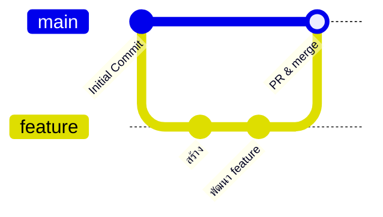
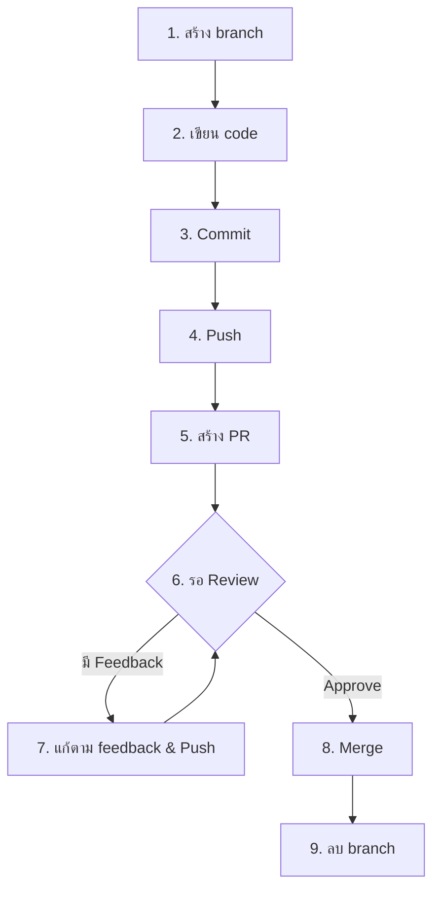
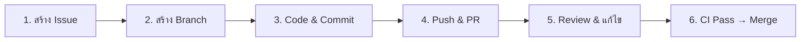

# GitHub Collaboration — Branch, PR & Code Review <Badge type="info" text="Module 3 · สัปดาห์ 5–6" />

> **Ref Book:** Pro Git — Chapter 3, 5


## 🌿 Branch คืออะไร?

**Branch** คือเส้นทางการพัฒนาแยกอิสระจาก main — ทำงาน feature ใหม่บน branch โดยไม่กระทบ code ที่ production ใช้อยู่



::: tip ทำไมต้อง Branch?
- ทำงานหลาย feature พร้อมกันได้
- ทดลองโดยไม่กลัวพัง main
- Review code ผ่าน Pull Request ก่อน merge
- ย้อน rollback ได้ง่ายถ้ามีปัญหา
:::


## 🛠️ คำสั่ง Branch พื้นฐาน

```bash
# ดู branch ทั้งหมด
git branch               # local branches
git branch -r            # remote branches
git branch -a            # ทั้ง local และ remote

# สร้าง branch ใหม่
git branch feature/add-tasks       # สร้างแต่ยังไม่ switch
git switch -c feature/add-tasks    # สร้างพร้อม switch (แนะนำ)
git checkout -b feature/add-tasks  # แบบเก่า (ยังใช้ได้)

# Switch branch
git switch main           # ไป main
git switch feature/add-tasks

# ลบ branch (หลัง merge แล้ว)
git branch -d feature/add-tasks    # ลบ local
git push origin --delete feature/add-tasks  # ลบ remote
```

### ชื่อ Branch ที่ดี

```bash
# ✅ ชัดเจน บอกได้ว่าทำอะไร
feature/add-task-endpoint
fix/null-pointer-in-task-delete
docs/update-api-readme
chore/update-dependencies

# ❌ ไม่ดี — ไม่รู้ว่าทำอะไร
my-branch
test123
fix
```


## 🔀 Merge — รวม Branch กลับ main

```bash
# switch ไป main ก่อน
git switch main

# merge feature branch เข้า main
git merge feature/add-tasks

# ถ้าไม่มี conflict: Fast-forward merge (สะอาด)
# ถ้ามี diverge: กด :wq ใน vim หรือ Merge commit message

# ดู graph หลัง merge
git log --oneline --graph --all
```

### Branching Strategy: Trunk-based vs GitFlow

| | Trunk-based Development | GitFlow |
| :--- | :--- | :--- |
| **หลักการ** | merge กลับ main บ่อยๆ (< 1 วัน) | แยก develop, release, hotfix branch |
| **เหมาะกับ** | CI/CD team, deploy บ่อย | release cycle ชัดเจน |
| **ความซับซ้อน** | ต่ำ | สูง |
| **ใช้ใน course** | ✅ | ❌ |


## ⚔️ Merge Conflicts — เมื่อ 2 คนแก้บรรทัดเดียวกัน

```
อรรถ แก้ไฟล์ src/tasks.ts บรรทัด 15
มิ้ง แก้ไฟล์ src/tasks.ts บรรทัด 15 เหมือนกัน

→ git ไม่รู้จะเอา version ไหน → CONFLICT!
```

```bash
# เมื่อ merge แล้วมี conflict
git merge feature/tasks
# CONFLICT (content): Merge conflict in src/tasks.ts

# เปิดไฟล์ที่มี conflict
cat src/tasks.ts
# ...
# <<<<<<< HEAD (version ของ main)
# const tasks: Task[] = [];
# =======
# const tasks: Task[] = defaultTasks;
# >>>>>>> feature/tasks (version ของ branch)
# ...
```

### วิธีแก้ Conflict

```bash
# 1. เปิดไฟล์ใน VS Code → จะเห็น UI ช่วย
#    Accept Current / Accept Incoming / Accept Both

# 2. แก้ไฟล์ด้วยตัวเอง — เลือก version ที่ถูก
# ลบ <<<, ===, >>> ออกให้หมด แล้วเก็บ code ที่ต้องการ

# 3. หลังแก้แล้ว
git add src/tasks.ts
git commit -m "fix: resolve merge conflict in tasks initialization"
```

::: tip ป้องกัน Conflict ได้อย่างไร?
- Pull จาก main บ่อยๆ (`git pull origin main --rebase`)
- ทำ branch ให้เล็กและ merge เร็ว (< 2 วัน)
- สื่อสารในทีมว่าใครแก้ไฟล์อะไร
:::


## 🌐 Remote Repository — ทำงานกับ GitHub

```bash
# เชื่อม local repo กับ GitHub
git remote add origin git@github.com:username/task-tracker.git

# ดู remote ที่มี
git remote -v
# origin  git@github.com:username/task-tracker.git (fetch)
# origin  git@github.com:username/task-tracker.git (push)

# Push ครั้งแรก
git push -u origin main          # -u = set upstream

# Push ครั้งต่อไป
git push

# Push branch ใหม่
git push origin feature/add-tasks

# Pull ดึง update ล่าสุดจาก remote
git pull                         # fetch + merge
git pull origin main             # ระบุ branch ชัดเจน
git fetch origin                 # ดึงข้อมูลแต่ไม่ merge
```


## 🔄 Pull Request (PR) — หัวใจของ Team Workflow

**Pull Request** คือการขอให้ทีม review code ก่อน merge — ทุก feature ผ่าน PR เสมอ

### วงจร PR



### สร้าง PR ที่ดี

```markdown
## Title
feat: add DELETE /tasks/:id endpoint

## Description
### What does this PR do?
เพิ่ม endpoint สำหรับลบ task ตาม ID

### Changes
- เพิ่ม `DELETE /tasks/:id` ใน `src/routes/tasks.ts`
- เพิ่ม unit test ใน `tests/tasks.test.ts`
- อัพเดต README พร้อม API example

### How to test
```bash
curl -X DELETE http://localhost:3000/api/tasks/1
# Expected: 204 No Content
```

### Checklist
- [x] เขียน test แล้ว
- [x] ทดสอบ local แล้ว
- [x] ไม่มี console.log เหลือ
- [x] README อัพเดตแล้ว

Closes #15
```


## 👀 Code Review — ให้ Feedback อย่างสร้างสรรค์

### หน้าที่ของ Reviewer

```markdown
✅ ตรวจสอบ:
- Logic ถูกต้องไหม?
- มี edge case ที่ไม่ได้ handle?
- ชื่อ variable/function สื่อความหมายไหม?
- มี test ครอบคลุมไหม?
- Security: มี input validation ไหม?

❌ ไม่ควรทำ:
- Comment เรื่อง formatting (ใช้ Prettier แทน)
- Nit-pick ทุกเรื่องเล็กน้อย
- โทษหรือตำหนิ
```

### รูปแบบ Comment ที่ดี

```markdown
# ❌ ไม่ดี
"โค้ดนี้แย่มาก"
"ทำไมทำแบบนี้?"

# ✅ ดี — บอกปัญหา + วิธีแก้ + เหตุผล
"ควรเพิ่ม try-catch ตรงนี้ด้วย เพราะถ้า DB connection หลุด
 จะ throw error ไม่จัดการ และ server จะ crash"

# ✅ ดี — Suggest เป็น code
"แนะนำใช้ Optional Chaining แทน:
 task?.id ?? 'unknown'"
```


## 🔒 Protected Branches — บังคับให้ทุก commit ผ่าน PR

ไปที่ GitHub repo → **Settings → Branches → Add branch protection rule**

ตั้งค่า:
- ✅ **Require a pull request before merging**
- ✅ **Require approvals** (อย่างน้อย 1 คน)
- ✅ **Require status checks to pass** (CI ต้อง pass ก่อน)
- ✅ **Do not allow bypassing the above settings**
- ❌ ห้าม allow force push

::: info ผลของ Branch Protection
```bash
# จะ push ตรงไปที่ main ไม่ได้อีกต่อไป
git push origin main
# remote: error: GH006: Protected branch update failed
# → ต้องทำผ่าน PR เท่านั้น
```
:::


## 🏷️ GitHub Issues — จัดการงานใน Repo

```markdown
# สร้าง Issue สำหรับทุก task
Title: [feat] เพิ่ม endpoint GET /tasks with filter
Body:
## Description
...
## Acceptance Criteria
- [ ] GET /tasks?status=done ส่งเฉพาะ task ที่ done
- [ ] มี unit test

## Labels: feat, backend
## Assignees: @อรรถ
## Milestone: Sprint 1
```

เชื่อม Issue กับ PR:
```bash
# ใน PR body ใส่
Closes #12    # จะปิด issue #12 อัตโนมัติเมื่อ PR merge
Fixes #8
Resolves #5
```


## 💡 สรุป

::: info Team Workflow ที่ถูกต้องในวิชานี้

:::


**← ก่อนหน้า:** [Git Fundamentals](/wk3/wk3-content1-git-basics)  
**ถัดไป →** [Git Advanced: Stash, Tags, Husky & Prettier](/wk3/wk3-content3-git-advanced)
