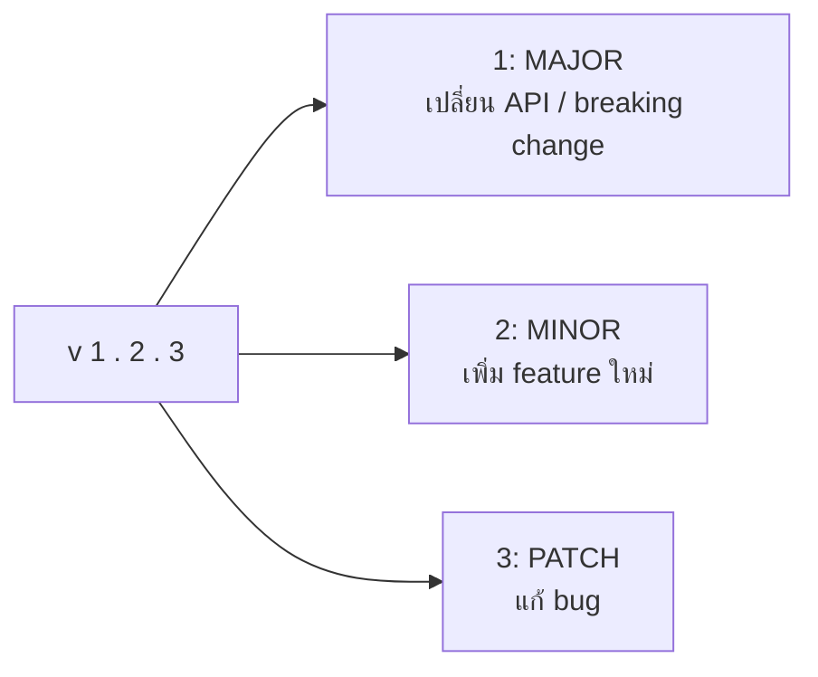

# Git Advanced — Stash, Tags, Husky & Prettier <Badge type="info" text="Module 3 · สัปดาห์ 5–6" />

> **Ref Book:** Pro Git — Chapter 7


## 📦 git stash — เก็บงานค้างชั่วคราว

สถานการณ์: กำลังเขียน feature ค้างอยู่ แต่ต้อง switch branch ด่วนเพื่อแก้ bug

```bash
# แทนที่จะ commit งานที่ยังไม่เสร็จ — ใช้ stash
git stash                    # เก็บ working tree ทั้งหมด (ยืดหยุ่น)
git stash push -m "WIP: add task filter"  # พร้อม label (แนะนำ)

# ตอนนี้ working tree สะอาด → switch ได้เลย
git switch main

# ...แก้ bug...

# กลับมา branch เดิม
git switch feature/add-filter

# คืน stash กลับ
git stash pop                # คืน stash ล่าสุด + ลบออกจาก list
git stash apply stash@{0}    # คืน stash โดยไม่ลบ

# ดู stash list
git stash list
# stash@{0}: On feature/add-filter: WIP: add task filter
# stash@{1}: On main: WIP: fix typo

# ลบ stash ที่ไม่ต้องการ
git stash drop stash@{1}
git stash clear              # ลบทั้งหมด
```


## 🏷️ Semantic Versioning — v1.0.0 คืออะไร?

**Semantic Versioning (SemVer)** คือมาตรฐานตั้งชื่อ version ที่ทุกคนเข้าใจตรงกัน



| เหตุการณ์ | Version เปลี่ยน | ตัวอย่าง |
| :--- | :--- | :--- |
| แก้ bug | `PATCH` +1 | `1.0.0` → `1.0.1` |
| เพิ่ม feature ใหม่ | `MINOR` +1, Patch = 0 | `1.0.1` → `1.1.0` |
| Breaking change | `MAJOR` +1, Minor = Patch = 0 | `1.1.0` → `2.0.0` |

::: info Version พิเศษ
- `0.x.x` = ยังอยู่ระหว่าง development (API เปลี่ยนได้)
- `1.0.0` = version แรกที่ release ให้ public
- `1.0.0-beta.1` = version ทดสอบก่อน release
:::


## 🔖 Git Tags — ทำ Release

Tag คือ "bookmark" บน commit ที่ระบุว่าเป็น release version นี้

```bash
# สร้าง annotated tag (แนะนำ)
git tag -a v1.0.0 -m "Release: Task Tracker v1.0.0"

# สร้าง tag บน commit เก่า
git tag -a v0.9.0 abc1234 -m "Release candidate"

# ดู tag ทั้งหมด
git tag

# ดูรายละเอียด tag
git show v1.0.0

# Push tag ขึ้น GitHub
git push origin v1.0.0       # push tag เดี่ยว
git push origin --tags       # push ทุก tag

# ลบ tag
git tag -d v1.0.0             # local
git push origin --delete v1.0.0  # remote
```

### สร้าง GitHub Release จาก Tag

ไปที่ GitHub repo → **Releases → Create a new release** → เลือก tag → เขียน release notes

```markdown
## Task Tracker v1.0.0 🎉

### New Features
- GET /tasks — ดึง task ทั้งหมด
- POST /tasks — สร้าง task ใหม่
- DELETE /tasks/:id — ลบ task

### Bug Fixes
- แก้ปัญหา server crash เมื่อ task ไม่มีอยู่

### Breaking Changes
- เปลี่ยน response format จาก array → { data: [], total: n }
```


## 🪝 Git Hooks — รันคำสั่งอัตโนมัติก่อน commit

**Git Hooks** คือ script ที่ Git รันอัตโนมัติเมื่อเกิด event ต่างๆ

| Hook | รันเมื่อ | ใช้ทำอะไร |
| :--- | :--- | :--- |
| `pre-commit` | ก่อน commit สำเร็จ | รัน lint, format, test |
| `commit-msg` | ตรวจสอบ commit message | enforce Conventional Commits |
| `pre-push` | ก่อน push | รัน test ทั้งหมด |
| `post-merge` | หลัง merge | `npm install` อัตโนมัติ |

ปัญหาของ Git Hooks เดิม: อยู่ใน `.git/hooks/` ซึ่งไม่ถูก commit เข้า repo — ทีมจะไม่ได้ใช้ร่วมกัน

**แก้ด้วย Husky** — จัดการ Git Hooks ผ่าน `package.json`


## 🐶 Husky + lint-staged — บังคับ Format ก่อน Commit

### ติดตั้ง Husky

```bash
npm install --save-dev husky lint-staged

# เปิดใช้งาน Husky
npx husky init
# จะสร้าง .husky/pre-commit
```

### ตั้งค่า lint-staged ใน `package.json`

```json
{
  "scripts": {
    "prepare": "husky"
  },
  "lint-staged": {
    "*.ts": [
      "eslint --fix",
      "prettier --write"
    ],
    "*.{json,md}": [
      "prettier --write"
    ]
  }
}
```

### สร้าง pre-commit hook

```bash
# .husky/pre-commit (สร้างอัตโนมัติจาก husky init)
cat > .husky/pre-commit << 'EOF'
npx lint-staged
EOF
```

ผล: ทุกครั้งที่ `git commit` → lint-staged จะรัน ESLint + Prettier กับไฟล์ที่ staged อัตโนมัติ

```bash
git add src/tasks.ts
git commit -m "feat: add filter"
# ✔ Preparing lint-staged...
# ✔ Running tasks for staged files...
#   ✔ ESLint: src/tasks.ts (fixed 2 issues)
#   ✔ Prettier: src/tasks.ts
# ✔ Applying modifications from tasks...
# [feature/filter abc123] feat: add filter
```

### ตั้งค่า commit-msg hook (Conventional Commits)

```bash
npm install --save-dev @commitlint/cli @commitlint/config-conventional

# สร้าง commitlint.config.js
cat > commitlint.config.js << 'EOF'
module.exports = { extends: ['@commitlint/config-conventional'] }
EOF

# สร้าง hook
cat > .husky/commit-msg << 'EOF'
npx --no -- commitlint --edit $1
EOF
```

ผล: commit message ที่ผิด format จะถูก reject ทันที

```bash
git commit -m "update stuff"
# ⧗  input: update stuff
# ✖  subject may not be empty [subject-empty]
# ✖  type may not be empty [type-empty]
# ✖  found 2 problems, 0 warnings
```


## 💅 Prettier — Format Code อัตโนมัติ

Prettier จัดการ style ให้ทั้งทีมไม่ต้องเถียงกันเรื่อง indentation, quotes, semicolons

### ติดตั้ง

```bash
npm install --save-dev prettier
```

### ตั้งค่า `.prettierrc`

```json
{
  "semi": false,
  "singleQuote": true,
  "tabWidth": 2,
  "trailingComma": "es5",
  "printWidth": 100
}
```

### `.prettierignore`

```
node_modules/
dist/
*.md
```

### ใช้งาน

```bash
# Format ไฟล์เดี่ยว
npx prettier --write src/tasks.ts

# Format ทุกไฟล์
npx prettier --write .

# ตรวจสอบโดยไม่แก้
npx prettier --check .
```

เพิ่ม script ใน `package.json`:
```json
{
  "scripts": {
    "format": "prettier --write .",
    "format:check": "prettier --check ."
  }
}
```


## 💡 สรุป

::: info เครื่องมือที่ต้องตั้งค่าในโปรเจกต์ Task Tracker
| เครื่องมือ | ติดตั้ง | ทำอะไร |
| :--- | :--- | :--- |
| **Husky** | `npm i -D husky` | จัดการ Git Hooks |
| **lint-staged** | `npm i -D lint-staged` | รัน lint/format บนไฟล์ที่ staged |
| **Prettier** | `npm i -D prettier` | Format code ให้สม่ำเสมอ |
| **commitlint** | `npm i -D @commitlint/...` | บังคับ Conventional Commits |

เมื่อตั้งค่าครบ: ทุก commit จะถูก format อัตโนมัติ และ message ที่ผิด format จะถูก reject
:::


**← ก่อนหน้า:** [GitHub Collaboration](/wk3/wk3-content2-github-collab)  
**ถัดไป →** [Lab: Team Workflow](/wk3/wk3-lab1-team-workflow)
