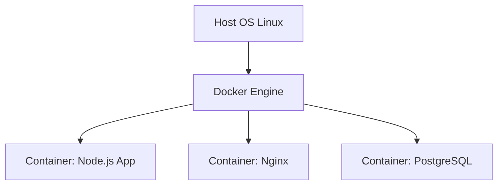
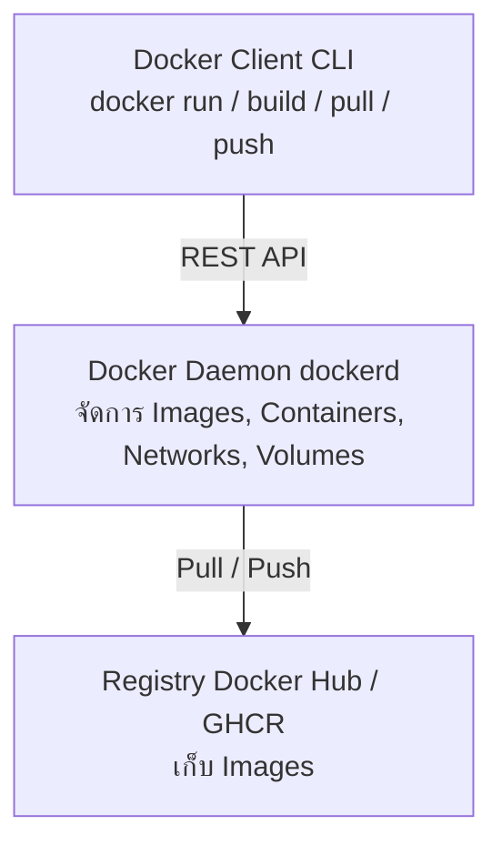
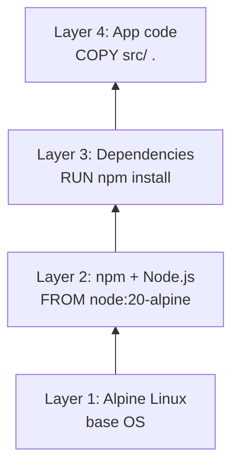
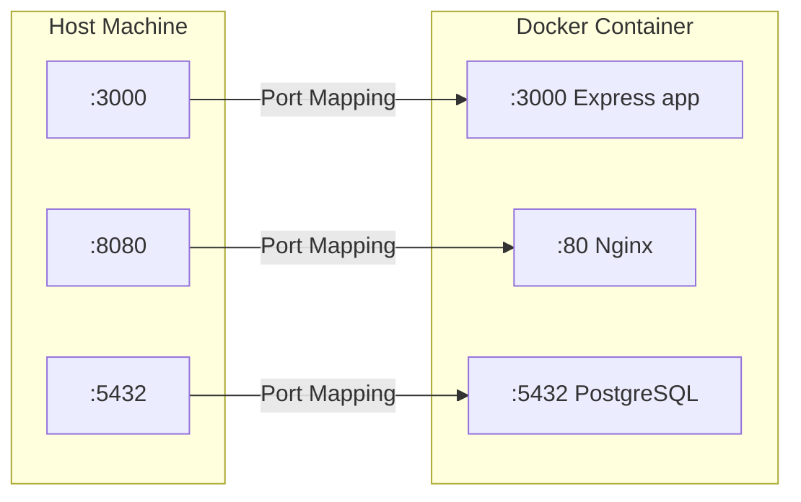

# Docker Basics — Image, Container & Registry <Badge type="info" text="Module 4 · สัปดาห์ 7–8" />

> **Ref Book:** Docker Deep Dive 2025 — Chapter 1–5


## 🐳 Docker คืออะไร และแก้ปัญหาอะไร?

ปัญหาคลาสสิกที่นักพัฒนาทุกคนเจอ:

```
Dev: "ทำไม app ฉันรันได้บนเครื่องฉัน แต่พัง production?"
Ops: "เครื่อง production ใช้ Ubuntu 20, เครื่องเธอ macOS..."
Dev: "Node.js version ก็ต่างกันด้วย..."
```

**Docker** แก้ปัญหานี้ด้วยการ **"บรรจุ app พร้อม environment ที่ต้องการทั้งหมดลงใน container"**

```
Container = App Code + Runtime + Dependencies + Config
           ทุกอย่างรวมกันในหน่วยเดียว
```

ผลลัพธ์: **"Works on my machine" → "Works everywhere"**


## 🆚 Container vs Virtual Machine

| | Container | Virtual Machine |
| :--- | :--- | :--- |
| **แชร์** | OS Kernel | ไม่แชร์อะไรเลย |
| **ขนาด** | MB | GB |
| **เริ่มต้น** | วินาที | นาที |
| **Isolation** | Process-level | Full OS |
| **ใช้ทรัพยากร** | น้อย | มาก |
| **ใช้กับ** | Microservices, CI/CD | Full OS testing |


แต่ละ container แยกกัน แต่ใช้ Kernel ร่วมกัน


## 🏗️ Docker Architecture



| ส่วน | หน้าที่ |
| :--- | :--- |
| **Docker Client** | CLI ที่คุณพิมพ์คำสั่ง |
| **Docker Daemon** | background service จัดการทุกอย่าง |
| **Image** | template สำหรับสร้าง container (read-only) |
| **Container** | instance ที่รัน Image (read-write) |
| **Registry** | ที่เก็บและแชร์ Image |


## 📦 Image — Blueprint ของ Container

Image คือ **snapshot แบบ read-only** ที่บรรจุทุกอย่างที่ app ต้องการ

### Layer System

Image ประกอบด้วย **layers** ที่ stack กัน:



Layer ที่ไม่เปลี่ยนจะถูก **cache** — ทำให้ build ครั้งต่อไปเร็วมาก


## 🛠️ คำสั่ง Docker พื้นฐาน

### จัดการ Image

```bash
# ดึง image จาก registry
docker pull node:20-alpine
docker pull nginx:latest

# ดู image ที่มีในเครื่อง
docker images
# REPOSITORY         TAG       IMAGE ID       CREATED       SIZE
# node               20-alpine abc123def456   2 weeks ago   181MB

# ลบ image
docker rmi node:20-alpine
docker rmi abc123def456       # ใช้ IMAGE ID ก็ได้

# ลบ image ที่ไม่มีใครใช้ทั้งหมด
docker image prune
```

### รัน Container

```bash
# รูปแบบพื้นฐาน
docker run <options> <image> <command>

# รัน interactive shell ใน Ubuntu
docker run -it ubuntu bash

# รัน Node.js app
docker run -d \                        # -d = detach (background)
  -p 3000:3000 \                       # -p host:container port mapping
  --name task-tracker \                # ตั้งชื่อ container
  -e NODE_ENV=production \             # environment variable
  node:20-alpine node server.js

# รัน พร้อม mount volume
docker run -d \
  -p 3000:3000 \
  -v $(pwd)/src:/app/src \            # mount folder local → container
  --name task-tracker \
  my-app:latest
```

### จัดการ Container

```bash
# ดู container ที่รันอยู่
docker ps

# ดูทุก container รวม stopped
docker ps -a

# หยุด container (graceful SIGTERM)
docker stop task-tracker

# Force stop (SIGKILL)
docker kill task-tracker

# เริ่ม container ที่หยุดอยู่
docker start task-tracker

# ลบ container (ต้อง stop ก่อน)
docker rm task-tracker

# หยุดและลบพร้อมกัน
docker stop task-tracker && docker rm task-tracker

# ลบทุก container ที่ stopped
docker container prune
```

### ดู Logs และ Debug

```bash
# ดู log
docker logs task-tracker
docker logs -f task-tracker          # follow (real-time)
docker logs --tail 100 task-tracker  # แค่ 100 บรรทัดล่าสุด

# เข้าไปใน container ที่รันอยู่
docker exec -it task-tracker bash    # เปิด shell
docker exec task-tracker ls /app     # รันคำสั่งเดียว

# ดูข้อมูล container
docker inspect task-tracker
docker stats                         # real-time resource usage (CPU, RAM)
```


## 🌐 Port Mapping



```bash
# -p <host-port>:<container-port>
docker run -p 3000:3000 my-app     # เข้าจาก localhost:3000
docker run -p 8080:80 nginx        # เข้า Nginx จาก localhost:8080
docker run -p 127.0.0.1:5432:5432 postgres  # เฉพาะ localhost เท่านั้น
```


## 🗄️ Registry — Docker Hub & GHCR

**Registry** คือที่เก็บและแชร์ Docker Images

| Registry | URL | ใช้ทำอะไร |
| :--- | :--- | :--- |
| **Docker Hub** | hub.docker.com | public images, free tier |
| **GHCR** | ghcr.io | GitHub Container Registry ✅ ใช้ในวิชา |
| **AWS ECR** | aws.amazon.com/ecr | AWS ecosystem |

```bash
# Push ขึ้น Docker Hub
docker login
docker tag my-app:latest username/task-tracker:v1.0.0
docker push username/task-tracker:v1.0.0

# Pull กลับมาใช้
docker pull username/task-tracker:v1.0.0

# Push ขึ้น GHCR
docker login ghcr.io -u GITHUB_USERNAME --password-stdin <<< "$GITHUB_TOKEN"
docker tag my-app:latest ghcr.io/GITHUB_USERNAME/task-tracker:v1.0.0
docker push ghcr.io/GITHUB_USERNAME/task-tracker:v1.0.0
```


## 🧹 Cleanup

```bash
# ลบทุกอย่างที่ไม่ใช้ (images, containers, networks, cache)
docker system prune

# ดู disk usage
docker system df
```


## 💡 สรุป

::: info คำสั่งที่ต้องจำก่อนเขียน Dockerfile
```bash
docker pull <image>          # ดึง image
docker run -d -p 3000:3000   # รัน container background
docker ps / docker ps -a     # ดู container
docker logs -f <name>        # ดู log real-time
docker exec -it <name> bash  # เข้าไปใน container
docker stop / rm <name>      # หยุดและลบ
docker images / rmi          # จัดการ image
```
:::


**← Module ก่อนหน้า:** [Lab wk3: Team Workflow](/wk3/wk3-lab1-team-workflow)  
**ถัดไป →** [Dockerfile & Docker Compose](/wk4/wk4-content2-dockerfile-compose)
