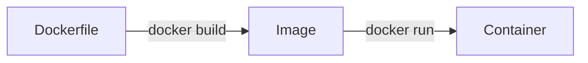

# Dockerfile & Docker Compose <Badge type="info" text="Module 4 · สัปดาห์ 7–8" />

> **Ref Book:** Docker Deep Dive 2025 — Chapter 6–10


## 📄 Dockerfile คืออะไร?

**Dockerfile** คือไฟล์ข้อความที่บอก Docker ว่าต้องสร้าง Image ยังไง — ทีละขั้นตอน




## 📝 Dockerfile Instructions ที่ใช้บ่อย

| Instruction | หน้าที่ | ตัวอย่าง |
| :--- | :--- | :--- |
| `FROM` | เลือก base image | `FROM node:20-alpine` |
| `WORKDIR` | กำหนด working directory | `WORKDIR /app` |
| `COPY` | copy ไฟล์จาก host | `COPY package*.json .` |
| `RUN` | รันคำสั่งตอน build | `RUN npm ci` |
| `EXPOSE` | ประกาศ port (documentation) | `EXPOSE 3000` |
| `ENV` | ตั้ง environment variable | `ENV NODE_ENV=production` |
| `CMD` | คำสั่งเริ่มต้นตอน run | `CMD ["node", "dist/index.js"]` |
| `ENTRYPOINT` | กำหนด executable หลัก | `ENTRYPOINT ["node"]` |
| `USER` | สลับ user (security) | `USER node` |
| `ARG` | build-time variable | `ARG APP_VERSION=1.0.0` |

::: warning CMD vs ENTRYPOINT
- `CMD` — คำสั่ง default ที่ override ได้: `docker run img npm test`
- `ENTRYPOINT` — executable หลักที่แทนไม่ได้: `docker run img --port 4000`
:::


## 🏗️ Dockerfile สำหรับ Task Tracker (Node.js + TypeScript)

### แบบพื้นฐาน (Single Stage)

```dockerfile
FROM node:20-alpine

WORKDIR /app

# Copy package files (แยกเพื่อ cache layer)
COPY package*.json ./
RUN npm ci

# Copy source code
COPY . .

# Build TypeScript → JavaScript
RUN npm run build

EXPOSE 3000

CMD ["node", "dist/index.js"]
```

### แบบ Multi-stage Build (แนะนำ)

Multi-stage แยก **build environment** ออกจาก **runtime environment** — image เล็กลงมาก

```dockerfile
# ══ Stage 1: Builder ══════════════════════════════════
FROM node:20-alpine AS builder

WORKDIR /app

COPY package*.json ./
RUN npm ci

COPY . .
RUN npm run build        # compile TypeScript → dist/


# ══ Stage 2: Production ═══════════════════════════════
FROM node:20-alpine AS production

WORKDIR /app

# copy เฉพาะ production dependencies
COPY package*.json ./
RUN npm ci --omit=dev    # ไม่ติดตั้ง devDependencies

# copy เฉพาะ compiled code จาก stage แรก
COPY --from=builder /app/dist ./dist

# Security: รันเป็น non-root user
USER node

EXPOSE 3000

CMD ["node", "dist/index.js"]
```

| | Single Stage | Multi-stage |
| :--- | :---: | :---: |
| Image size | ~500MB | ~150MB |
| TypeScript compiler | ✅ อยู่ใน image | ❌ ไม่มีใน prod |
| devDependencies | ✅ ติดตั้ง | ❌ ไม่มี |
| Build time | เร็วกว่า | ช้ากว่า (ครั้งแรก) |


## 🗂️ .dockerignore — อย่า COPY สิ่งที่ไม่จำเป็น

```bash
# .dockerignore
node_modules/      # ← ห้ามลืม! 300MB+ ที่ไม่ต้องการ
.git/              # git history
.env               # secrets!
dist/              # build output เดิม
*.log
.DS_Store
README.md
.vscode/
```

::: warning ถ้าไม่มี .dockerignore
`COPY . .` จะ copy `node_modules` เข้า image ด้วย → image ใหญ่โดยไม่จำเป็น
:::


## 🔨 สร้างและรัน Image

```bash
# Build image
docker build -t task-tracker:latest .
docker build -t task-tracker:v1.0.0 .
docker build --no-cache -t task-tracker:latest .   # force rebuild

# รัน
docker run -d -p 3000:3000 --name api task-tracker:latest

# ทดสอบ
curl http://localhost:3000/health
```


## 🐙 Docker Compose — รันหลาย Container พร้อมกัน

**Docker Compose** ใช้ไฟล์ `docker-compose.yml` กำหนด services ทั้งหมดของ app

```yaml
# docker-compose.yml
services:

  api:
    build: .                          # build จาก Dockerfile ใน current dir
    ports:
      - "3000:3000"                   # host:container
    environment:
      - NODE_ENV=production
      - PORT=3000
    env_file:
      - .env                          # โหลดจาก .env file
    volumes:
      - ./logs:/app/logs              # persist logs
    restart: unless-stopped           # restart อัตโนมัติเมื่อ crash

  db:
    image: postgres:15-alpine         # ใช้ official image
    environment:
      POSTGRES_DB: taskdb
      POSTGRES_USER: admin
      POSTGRES_PASSWORD: ${DB_PASSWORD}  # อ่านจาก .env
    volumes:
      - db-data:/var/lib/postgresql/data  # named volume (persist)
    ports:
      - "5432:5432"

volumes:
  db-data:                            # named volume declaration
```


## ⚙️ คำสั่ง Docker Compose

```bash
# เริ่ม services ทั้งหมด (background)
docker compose up -d

# เริ่มพร้อม rebuild image
docker compose up -d --build

# หยุด services (container ยังอยู่)
docker compose stop

# หยุดและลบ container
docker compose down

# หยุด ลบ container + volumes
docker compose down -v

# ดู logs
docker compose logs -f              # ทุก service
docker compose logs -f api          # เฉพาะ service api

# ดูสถานะ
docker compose ps

# รันคำสั่งใน service
docker compose exec api bash
docker compose exec api node -e "console.log(process.env.NODE_ENV)"

# รีสตาร์ท service เดี่ยว
docker compose restart api
```


## 🌐 Networks ใน Compose

Services ใน Compose อยู่บน **network เดียวกัน** และเรียกหากันด้วย **ชื่อ service**:

```yaml
services:
  api:
    image: task-tracker:latest
    environment:
      # เรียก postgres ด้วยชื่อ service "db" ได้เลย
      DATABASE_URL: postgres://admin:pass@db:5432/taskdb

  db:
    image: postgres:15-alpine
```

```bash
# ใน container api สามารถ ping db ได้เลย
docker compose exec api ping db
docker compose exec api curl http://db:5432
```


## 📁 Volumes — Persist ข้อมูล

```yaml
services:
  api:
    volumes:
      # Bind mount — sync กับ host (ใช้ตอน dev)
      - ./src:/app/src

  db:
    volumes:
      # Named volume — managed by Docker (ใช้ตอน prod)
      - db-data:/var/lib/postgresql/data

volumes:
  db-data:
```

| Type | ใช้เมื่อ |
| :--- | :--- |
| **Bind mount** `./host:/container` | dev: sync code แบบ real-time |
| **Named volume** `name:/container` | prod: persist database |
| **tmpfs** | sensitive data ในหน่วยความจำชั่วคราว |


## 💡 สรุป

::: info โครงสร้างไฟล์ที่ควรมีในโปรเจกต์ Task Tracker
```
task-tracker/
├── Dockerfile            ← Multi-stage build
├── .dockerignore         ← exclude node_modules + .env
├── docker-compose.yml    ← services: api + db
├── docker-compose.override.yml  ← dev overrides
└── src/
```
:::


**← ก่อนหน้า:** [Docker Basics](/wk4/wk4-content1-docker-basics)  
**ถัดไป →** [Docker Security](/wk4/wk4-content3-docker-security)
