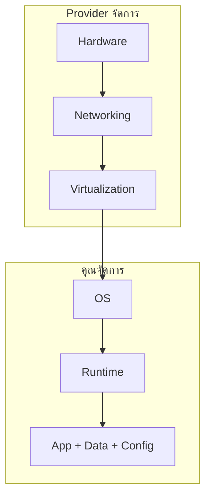
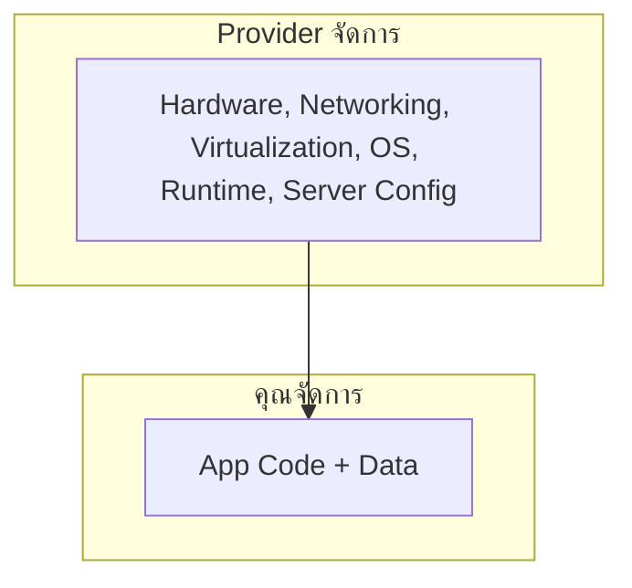
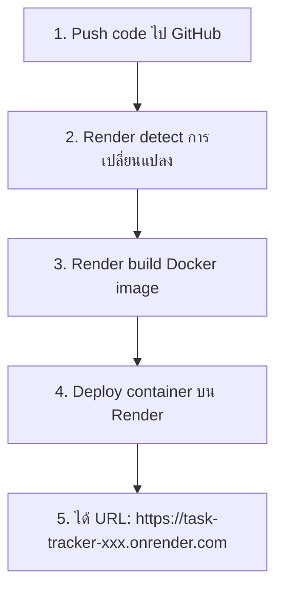

# Cloud Fundamentals — IaaS, PaaS, SaaS & Render <Badge type="info" text="Module 4 · สัปดาห์ 7–8" />

> **Ref Book:** Beyond the 12-Factor App — Chapter 1


## ☁️ Cloud คืออะไร?

Cloud Computing คือการใช้ **computing resources (server, network, storage) ผ่าน internet** โดยไม่ต้องซื้อ hardware เอง — จ่ายเฉพาะที่ใช้

ก่อน cloud: ซื้อ server เอง → ตั้งใน data center → จ้างคนดูแล → ขยายยาก  
หลัง cloud: เปิด browser → เลือก VM → ใช้งานได้ใน 5 นาที


## 🏗️ IaaS / PaaS / SaaS — เปรียบเหมือนการเช่าที่พัก

```
เปรียบกับการเช่าที่อยู่อาศัย:

IaaS = เช่าที่ดินเปล่า     → ต้องสร้างบ้านเอง
PaaS = เช่าบ้านสำเร็จรูป  → แค่ย้ายเข้าอยู่
SaaS = เช่าโรงแรม         → ทุกอย่างพร้อม แค่เช็คอิน
```

### IaaS — Infrastructure as a Service

คุณได้รับ: **Virtual Machine, Networking, Storage**  
คุณต้องทำเอง: OS, Runtime, App, Database



ตัวอย่าง: **AWS EC2, GCP Compute Engine, Azure VM, DigitalOcean Droplets**

### PaaS — Platform as a Service

คุณได้รับ: **Platform พร้อมรัน App**  
คุณต้องทำเอง: แค่ App code



ตัวอย่าง: **Render, Railway, Heroku, Google App Engine**  
✅ **ใช้ใน course นี้: Render**

### SaaS — Software as a Service

คุณได้รับ: **Software พร้อมใช้ผ่าน browser**  
คุณไม่ต้องทำอะไรเลย

ตัวอย่าง: **Gmail, Figma, GitHub, Notion, Slack**

### เปรียบเทียบ

| | IaaS | PaaS | SaaS |
| :--- | :---: | :---: | :---: |
| ควบคุมได้มาก | ✅ | ⚠️ | ❌ |
| ตั้งค่าง่าย | ❌ | ✅ | ✅✅ |
| Scale เอง | ต้องทำเอง | อัตโนมัติ | อัตโนมัติ |
| เหมาะกับ | Corp / Enterprise | Startup / Student | ทุกคน |
| ราคา | จ่ายตาม VM | จ่ายตาม usage | Subscription |


## 🌍 Major Cloud Providers

| Provider | ชื่อเล่น | จุดเด่น |
| :--- | :--- | :--- |
| **AWS** | Amazon Web Services | ใหญ่ที่สุด, ครบที่สุด, 200+ services |
| **GCP** | Google Cloud | ML/AI, BigQuery, Kubernetes (GKE) |
| **Azure** | Microsoft Azure | Enterprise, Active Directory integration |

::: info เรียนอะไรในวิชานี้?
ไม่ต้องสมัคร AWS — ใช้ **Render** (PaaS ฟรี) ซึ่งทำงานบน AWS เบื้องหลัง  
Concept ที่เรียนนำไปใช้กับทุก provider ได้
:::


## 🗺️ Region & Availability Zone

Cloud providers กระจาย data center ทั่วโลก:

```
AWS Region: ap-southeast-1 (Singapore)
├── Availability Zone A  (data center building A)
├── Availability Zone B  (data center building B)
└── Availability Zone C  (data center building C)
```

| คำศัพท์ | ความหมาย |
| :--- | :--- |
| **Region** | พื้นที่ภูมิศาสตร์ เช่น Singapore, Tokyo, US East |
| **Availability Zone (AZ)** | data center แยกกันในภูมิภาคเดียว |
| **Edge Location** | CDN node ใกล้ผู้ใช้ (CloudFront, Cloudflare) |

**ทำไมต้องกระจาย?**
- ถ้า AZ หนึ่งดับ — AZ อื่นยังทำงานได้ (High Availability)
- ถ้า Region หนึ่งพัง — Route traffic ไป Region อื่นได้ (Disaster Recovery)


## 🚀 Render — PaaS ที่ใช้ใน Course

**Render** คือ PaaS ที่ deploy Docker container ได้ง่ายมาก มี **free tier** เหมาะกับนักเรียน

### ทำไมใช้ Render?

| เหตุผล | รายละเอียด |
| :--- | :--- |
| **Free tier** | Web Service ฟรี (หยุดหลัง 15 นาที idle) |
| **Docker support** | deploy จาก Dockerfile หรือ Docker image โดยตรง |
| **Auto deploy** | push ไป GitHub → deploy อัตโนมัติ |
| **HTTPS ฟรี** | Let's Encrypt certificate อัตโนมัติ |
| **Env variables** | ตั้งค่าผ่าน dashboard ได้เลย |

### เส้นทาง Deploy บน Render



### Free Tier Limitations

::: warning ข้อจำกัด Render Free Tier
- Web Service **หยุดทำงานหลัง 15 นาที** ที่ไม่มี traffic
- เมื่อมี request ใหม่ — ต้อง **cold start ~30 วินาที** ก่อน respond
- RAM จำกัด 512 MB
- ไม่เหมาะกับ production จริง — ใช้เพื่อการเรียนเท่านั้น
:::


## 📐 เปรียบ: Local → VPS → PaaS → Serverless

| คุณสมบัติ | Local Machine | VPS (IaaS) | PaaS (Render) | Serverless (Lambda) |
| :--- | :--- | :--- | :--- | :--- |
| **ควบคุม** | 100% | OS + App | แค่ App | แค่ Code |
| **รัน 24/7** | ❌ ไม่ได้ | ✅ | ✅ | รันตาม event |
| **ราคา** | $0 | $5-20/mo | ฟรี-$7/mo | จ่ายต่อ invocation |
| **ใช้ตอน** | dev | Prod (Control) | ✅ course (Learn) | Event-driven |


## 🐳 Container as a Service (CaaS)

แทนที่จะตั้ง server เอง → รัน Docker Container บน Cloud โดยตรง

```
ตัวเลือก CaaS:
├── AWS ECS (Elastic Container Service)
├── Google Cloud Run
├── Azure Container Instances
├── Render (PaaS ที่รับ Docker) ← ใช้ใน course
└── Railway
```

เมื่อ push image ขึ้น GHCR → Render pull มา deploy → มี URL ทันที


## 💡 สรุป

::: info สิ่งที่เรียนในวิชานี้ vs Cloud ทั้งหมด
| แนวคิด | ใช้จริงในวิชา |
| :--- | :--- |
| PaaS concept | ✅ ใช้ Render deploy Task Tracker |
| Container on cloud | ✅ Docker image → Render |
| Auto deploy | ✅ GitHub push → Render webhook |
| HTTPS/TLS | ✅ Render จัดการให้อัตโนมัติ |
| Env variables | ✅ ตั้งใน Render dashboard |
| Region (concept) | 📖 เรียน concept เท่านั้น |
:::


**← ก่อนหน้า:** [Docker Security](/wk4/wk4-content3-docker-security)  
**ถัดไป →** [Lab 1: Containerize Task Tracker](/wk4/wk4-lab1-containerize)
