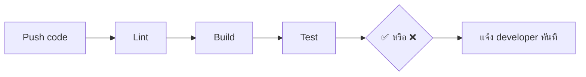
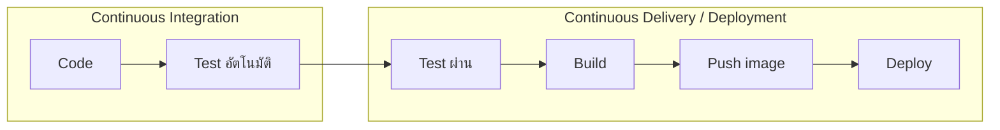
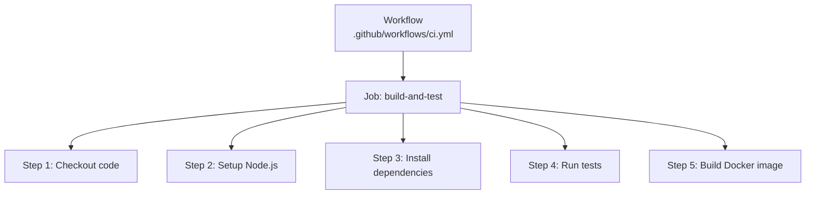

# CI/CD Basics — GitHub Actions <Badge type="info" text="Module 6 · สัปดาห์ 10–12" />

> **Ref Book:** Learning GitHub Actions — Chapter 1–4

::: info 📌 ทบทวนจาก Module ก่อนหน้า
**สัปดาห์ 1–4:** เรียน DevOps concept + Linux CLI + Git + Docker  
**สัปดาห์ 5 (Midterm):** ส่ง Task Tracker ที่รันได้บน Docker ✅  
**Module 6 นี้:** นำ Docker image ที่มีอยู่มาต่อ CI/CD Pipeline อัตโนมัติบน GitHub Actions
:::


## 🔄 CI/CD คืออะไร?

### Continuous Integration (CI)

> **"รัน test อัตโนมัติทุกครั้งที่ push code"**

ก่อนมี CI: Developer push code → รอ QA test manual → รู้ว่าพังหลังผ่านไปหลายวัน  
หลังมี CI: Developer push code → CI รัน test ทันที → รู้ว่าพังภายใน 5 นาที



### Continuous Delivery vs Continuous Deployment

| | Continuous Delivery | Continuous Deployment |
| :--- | :--- | :--- |
| **คำนิยาม** | พร้อม deploy ได้ตลอด (แต่ยังไม่ deploy) | deploy อัตโนมัติทุก commit |
| **Manual step** | ✅ มีคนกด deploy | ❌ ไม่มี — อัตโนมัติทั้งหมด |
| **เหมาะกับ** | ต้องการ approval ก่อน | ทีมที่มั่นใจใน test coverage 100% |
| **ใน course นี้** | ✅ ใช้แบบนี้ | — |




## ⚙️ GitHub Actions คืออะไร?

GitHub Actions คือ CI/CD platform ที่ **built-in อยู่ใน GitHub** ฟรี (2,000 นาที/เดือน)

### ส่วนประกอบหลัก



| ส่วน | หน้าที่ |
| :--- | :--- |
| **Workflow** | ไฟล์ YAML ที่กำหนด pipeline ทั้งหมด |
| **Job** | กลุ่มของ Steps ที่รันบน Runner เดียวกัน |
| **Step** | คำสั่งเดี่ยว หรือ Action |
| **Runner** | Virtual machine ที่รัน Job (GitHub-hosted: ubuntu-latest) |
| **Action** | package สำเร็จรูปเช่น `actions/checkout@v4` |
| **Event/Trigger** | สิ่งที่ทำให้ Workflow รัน เช่น `push`, `pull_request` |


## 📝 YAML Syntax — Workflow แรก

```yaml
# .github/workflows/ci.yml
name: CI Pipeline                    # ชื่อ workflow (แสดงใน GitHub)

on:                                  # trigger: เมื่อไรให้รัน
  push:
    branches: [main, develop]        # รันเมื่อ push ไป branches เหล่านี้
  pull_request:
    branches: [main]                 # รันเมื่อสร้าง PR มา main

jobs:                                # งานที่ต้องทำ (รัน parallel ได้)
  build-and-test:                    # ชื่อ job
    runs-on: ubuntu-latest           # runner OS

    steps:
      - name: Checkout code          # ชื่อแต่ละ step (แสดงใน UI)
        uses: actions/checkout@v4    # ใช้ action สำเร็จรูปจาก Marketplace

      - name: Setup Node.js
        uses: actions/setup-node@v4
        with:
          node-version: '20'         # parameter ของ action
          cache: 'npm'               # cache node_modules

      - name: Install dependencies
        run: npm ci                  # รันคำสั่ง shell

      - name: Lint
        run: npm run lint

      - name: Build TypeScript
        run: npm run build

      - name: Run tests
        run: npm test
```


## 🎯 Trigger Events — เมื่อไรให้ Workflow รัน

```yaml
on:
  # รันเมื่อ push
  push:
    branches: [main]
    paths:                           # รันเฉพาะเมื่อไฟล์เหล่านี้เปลี่ยน
      - 'src/**'
      - 'package.json'

  # รันเมื่อสร้าง/update PR
  pull_request:
    branches: [main]
    types: [opened, synchronize, reopened]

  # รันตามเวลา (cron)
  schedule:
    - cron: '0 2 * * *'             # ทุกคืน 02:00 UTC

  # รันด้วยตนเองจาก GitHub UI
  workflow_dispatch:
    inputs:
      environment:
        description: 'Deploy to which env?'
        required: true
        default: 'staging'
```


## 🧩 Actions Marketplace

**Actions Marketplace** คือ library ของ action สำเร็จรูปที่ community สร้างไว้

```yaml
steps:
  # Official actions (เชื่อถือได้)
  - uses: actions/checkout@v4          # checkout code
  - uses: actions/setup-node@v4        # setup Node.js
  - uses: actions/cache@v4             # cache dependencies
  - uses: actions/upload-artifact@v4   # เก็บ build output

  # Docker actions
  - uses: docker/login-action@v3       # login registry
  - uses: docker/build-push-action@v5  # build + push image
  - uses: docker/metadata-action@v5    # generate tags

  # Third-party (ตรวจสอบ ⭐ และ verified ก่อนใช้)
  - uses: codecov/codecov-action@v4    # upload coverage report
```

::: warning ใช้ version pinning เสมอ
```yaml
# ❌ ไม่ดี — อาจเปลี่ยน behavior โดยไม่รู้
uses: actions/checkout@main

# ✅ ดี — ระบุ version ชัดเจน
uses: actions/checkout@v4
```
:::


## 🔍 ดู Workflow Run ใน GitHub

ไปที่ GitHub repo → แท็บ **Actions**

```
Workflow Runs
├── ✅ CI Pipeline           → push to main  (2 min ago)
├── ✅ CI Pipeline           → PR #15        (1 hr ago)
└── ❌ CI Pipeline           → push to main  (3 hrs ago)  ← คลิกดู log
```

เมื่อ fail ให้คลิกที่ run → คลิก Job → คลิก Step ที่พัง → อ่าน log


## 🌐 Context & Expressions

```yaml
steps:
  - name: Debug info
    run: |
      echo "Branch: ${{ github.ref_name }}"
      echo "Commit: ${{ github.sha }}"
      echo "Actor: ${{ github.actor }}"
      echo "Event: ${{ github.event_name }}"
      echo "Repo: ${{ github.repository }}"
```

| Context | ข้อมูล |
| :--- | :--- |
| `github.ref_name` | ชื่อ branch เช่น `main` |
| `github.sha` | full commit hash |
| `github.actor` | user ที่ trigger workflow |
| `github.event_name` | `push`, `pull_request`, etc. |
| `secrets.MY_SECRET` | ค่า secret ที่ตั้งไว้ใน repo |


## 💡 สรุป

::: info โครงสร้าง Workflow ที่ต้องจำ
```yaml
name: CI

on:
  push:
    branches: [main]
  pull_request:
    branches: [main]

jobs:
  ci:
    runs-on: ubuntu-latest
    steps:
      - uses: actions/checkout@v4
      - uses: actions/setup-node@v4
        with:
          node-version: '20'
          cache: 'npm'
      - run: npm ci
      - run: npm run build
      - run: npm test
```
:::


**← ก่อนหน้า:** [Midterm Project](/wk5/wk5-midterm-exam)  
**ถัดไป →** [Advanced GitHub Actions](/wk6/wk6-content2-advanced-actions)
