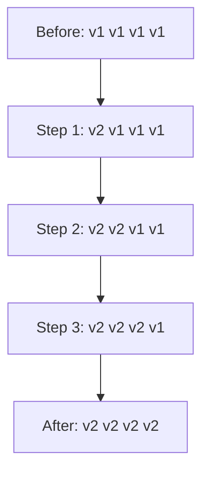
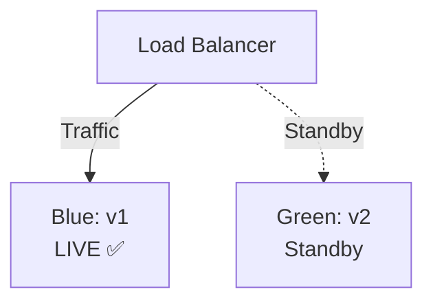
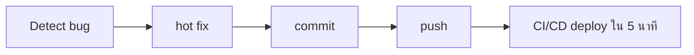

# Deployment Workflow Patterns <Badge type="info" text="Module 6 · สัปดาห์ 10–12" />

> **Ref Book:** The DevOps Handbook — Part III: Technical Practices


## 🚀 Rolling Deployment — อัปเดตทีละ Instance

**หลักการ:** อัปเดต server ทีละตัว ไม่ downtime ทั้งหมดพร้อมกัน



| | Rolling |
| :--- | :--- |
| **Downtime** | ❌ ไม่มี |
| **ค่าใช้จ่าย** | ต่ำ (ใช้ server เดิม) |
| **Rollback** | ช้า (ต้องอัปเดตกลับทีละตัว) |
| **เหมาะกับ** | เริ่มต้น, budget น้อย |


## 🔵🟢 Blue-Green Deployment — สลับ Traffic ทันที

**หลักการ:** มี environment 2 ชุด (Blue = ปัจจุบัน, Green = ใหม่) สลับ traffic ผ่าน Load Balancer


Deploy ใหม่:
1. Build v2 บน Green
2. Test Green ให้ผ่าน
3. สลับ LB → Green (ใช้เวลา < 1 วินาที)
4. Blue กลายเป็น Standby (rollback ทันที)

| | Blue-Green |
| :--- | :--- |
| **Downtime** | ❌ ไม่มี (< 1 วินาที) |
| **ค่าใช้จ่าย** | สูง (ต้องมี server 2 เท่า) |
| **Rollback** | ⚡ ทันที (สลับ LB กลับ) |
| **เหมาะกับ** | Production ที่ downtime แพง |


## 🐦 Canary Deployment — ปล่อย Version ใหม่ให้บาง User ก่อน

**หลักการ:** ปล่อย v2 ให้ user บางส่วน (5–10%) ก่อน แล้วค่อยขยาย

```mermaid
graph LR
    P1[Phase 1<br/>v1 95% | v2 5%] -->|Monitor| P2[Phase 2<br/>v1 50% | v2 50%]
    P2 -->|ขยาย| P3[Phase 3<br/>v1 0% | v2 100%]
```

| | Canary |
| :--- | :--- |
| **Downtime** | ❌ ไม่มี |
| **ค่าใช้จ่าย** | ปานกลาง |
| **Rollback** | เร็ว (ลด traffic กลับ) |
| **เหมาะกับ** | Feature ใหม่ที่ไม่แน่ใจ |


## 📊 เปรียบเทียบ 3 Patterns

| | Rolling | Blue-Green | Canary |
| :--- | :---: | :---: | :---: |
| Downtime | ❌ | ❌ | ❌ |
| Rollback speed | ช้า | ⚡ ทันที | เร็ว |
| ค่าใช้จ่าย | ต่ำ | สูง | ปานกลาง |
| ความซับซ้อน | ต่ำ | ปานกลาง | สูง |
| ใช้ใน course | ✅ | concept | concept |

::: info ใช้อะไรในวิชานี้?
**Rolling Deployment** แบบง่าย — push image → Render pull → restart container  
Render ทำ rolling update ให้อัตโนมัติโดยไม่ต้องตั้งค่า
:::


## ↩️ Rollback Strategy — ถ้า Deploy แล้วพัง ทำอะไร?

> ถามทุก DevOps interview: "ถ้า deploy ไปแล้วพัง คุณทำอะไร?"

### Rollback ใน GitHub Actions

```yaml
# กลยุทธ์ที่ 1: Redeploy version ก่อนหน้า
- name: Rollback on failure
  if: failure()
  run: |
    PREV_IMAGE="ghcr.io/${{ github.repository }}:prev"
    curl -X POST "${{ secrets.RENDER_DEPLOY_HOOK }}&imgURL=$PREV_IMAGE"

# กลยุทธ์ที่ 2: Tag image ก่อน deploy เสมอ
- name: Tag as 'prev' before deploy
  run: |
    docker tag $IMAGE:latest $IMAGE:prev
    docker push $IMAGE:prev
```

### Rollback ใน Render

```bash
# Render Dashboard → Service → Events → เลือก deploy เก่า → Redeploy
# หรือใช้ Render API
curl -X POST "https://api.render.com/v1/services/$SERVICE_ID/deploys" \
  -H "Authorization: Bearer $RENDER_API_KEY" \
  -d '{"clearCache": false}'
```

### Roll Forward แทน Rollback

บางครั้งเร็วกว่า rollback คือ **แก้ bug และ deploy ใหม่ทันที**:



::: tip กฎ 5 นาที
ถ้า fix ได้เร็วกว่า rollback → Roll Forward  
ถ้า fix ใช้เวลานาน → Rollback ก่อน แก้ทีหลัง
:::


## 🌿 GitHub Environments: staging vs production

### สร้าง Environment ใน GitHub

**Settings → Environments → New environment**

```
staging (ไม่มี protection)
  └── secrets: RENDER_STAGING_HOOK

production (มี protection)
  ├── Required reviewers: [teacher-username]
  ├── Wait timer: 5 minutes
  └── secrets: RENDER_PRODUCTION_HOOK
```

### Workflow แยก staging / production

```yaml
name: Deploy Pipeline

on:
  push:
    branches: [main]

jobs:
  deploy-staging:
    runs-on: ubuntu-latest
    environment:
      name: staging
      url: https://task-tracker-staging.onrender.com
    steps:
      - name: Deploy to staging
        run: |
          echo "🔵 Deploying to staging..."
          curl -X POST "${{ secrets.RENDER_STAGING_HOOK }}"
          echo "✅ Staging deploy triggered"

  smoke-test-staging:
    needs: deploy-staging
    runs-on: ubuntu-latest
    steps:
      - name: Wait for deploy
        run: sleep 60

      - name: Smoke test staging
        run: |
          STATUS=$(curl -s -o /dev/null -w "%{http_code}" \
            https://task-tracker-staging.onrender.com/health)
          if [ "$STATUS" != "200" ]; then
            echo "❌ Staging health check failed: $STATUS"
            exit 1
          fi
          echo "✅ Staging is healthy"

  deploy-production:
    needs: smoke-test-staging
    runs-on: ubuntu-latest
    environment:
      name: production                    # ← ต้องรอ reviewer approve
      url: https://task-tracker.onrender.com
    steps:
      - name: Deploy to production
        run: |
          echo "🚀 Deploying to production..."
          curl -X POST "${{ secrets.RENDER_PRODUCTION_HOOK }}"
```


## 💡 สรุป

::: info 3 Patterns + Rollback
| Pattern | ใช้เมื่อ | ความเสี่ยง |
| :--- | :--- | :--- |
| **Rolling** | ทั่วไป, budget น้อย | Rollback ช้า |
| **Blue-Green** | Production critical | ค่าใช้จ่ายสูง |
| **Canary** | Feature ใหม่ไม่แน่ใจ | ซับซ้อน |
| **Rollback** | deploy พัง | ต้องเตรียมไว้เสมอ |
:::


**← ก่อนหน้า:** [Advanced GitHub Actions](/wk6/wk6-content2-advanced-actions)  
**ถัดไป →** [Secrets Management & Dependabot](/wk6/wk6-content4-secrets-management)
