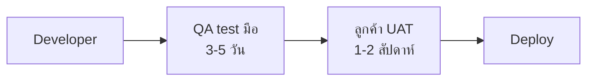
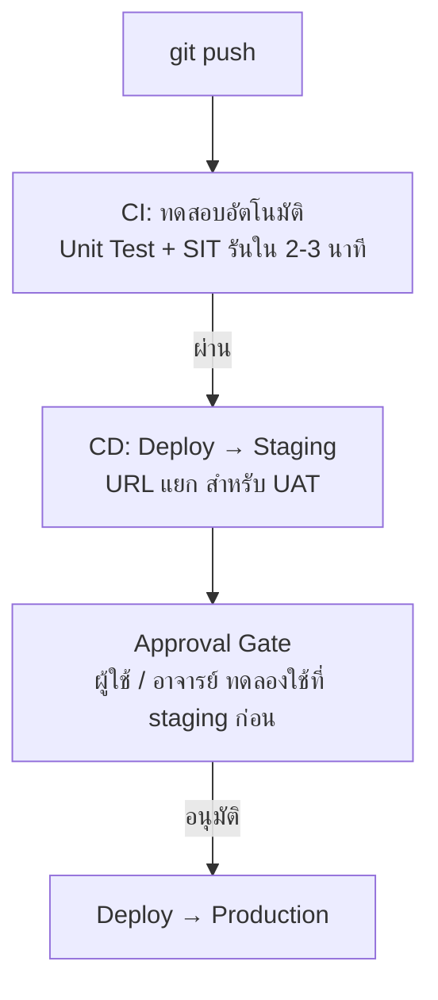

# Testing Strategy ใน DevOps <Badge type="info" text="Module 7 · Testing" />

::: info 📌 ทบทวนจาก Module ก่อนหน้า
**Module 6:** สร้าง CI/CD Pipeline ด้วย GitHub Actions — `git push` แล้ว deploy อัตโนมัติ ✅  
**Module 7 นี้:** เพิ่ม **Testing** เข้าไปใน pipeline — ให้ CI ตรวจ bug ก่อนที่ code จะถึง production
:::

::: danger 🚨 เคยเจอปัญหานี้ไหม?
ทีมพัฒนา Task Tracker ทำงานหนักมาหลายวัน deploy ขึ้น production แล้ว...
**ผู้ใช้โทรมาแจ้งว่า "กด Delete แล้ว task ของคนอื่นหายไปด้วย"**

ทีมต้องนั่ง debug กลางดึก rollback ระบบ แล้วขอโทษลูกค้า

**ถ้ามี testing ที่ดี ปัญหานี้จะถูกจับตั้งแต่ก่อน deploy**
:::

> 💡 **เปรียบเทียบ:** การ test ซอฟต์แวร์เหมือนการตรวจรถก่อนออกเดินทาง — ตรวจล้อ (Unit Test) → ทดลองขับในลานจอด (SIT) → ให้ลูกค้านั่งทดลอง (UAT) ทำครบก่อนออกถนนจริง (Production)


## คำศัพท์พื้นฐาน — 3 ระดับการทดสอบ

ก่อนเรียน DevOps pipeline ต้องรู้ว่าแต่ละระดับต่างกันอย่างไร:

| ระดับ | ชื่อเต็ม | ทดสอบอะไร | ใครทดสอบ |
| :--- | :--- | :--- | :--- |
| **Unit Test** | Unit Testing | function/module ย่อยแต่ละตัว แยกกัน | Developer |
| **SIT** | System Integration Testing | หลาย component ทำงานร่วมกันได้ไหม | Developer / QA |
| **UAT** | User Acceptance Testing | ระบบตรงกับที่ผู้ใช้ต้องการไหม | ผู้ใช้จริง / ลูกค้า |


## ขั้นตอนที่ 1 — Unit Test คืออะไร

Unit Test คือการทดสอบ **ชิ้นเล็กที่สุดของโค้ด** แยกออกมาโดด ๆ ไม่มีการเชื่อมต่อ database หรือ network

::: code-group
```ts [✅ Unit Test ที่ดี]
// [1] ทดสอบ function calculateTotal แยกออกมาเดี่ยว ๆ
// [2] ไม่มี database ไม่มี HTTP request
// [3] รันเร็ว < 1ms ต่อ test

describe('calculateTotal', () => {
  it('should return sum of all task priorities', () => {
    const tasks = [               // [4] ข้อมูล mock ตายตัว
      { id: 1, priority: 3 },
      { id: 2, priority: 5 },
    ]
    const result = calculateTotal(tasks)
    expect(result).toBe(8)        // [5] ตรวจผลลัพธ์ที่คาดหวัง
  })
})
```

```ts [❌ Unit Test ที่ผิด]
// ❌ นี่ไม่ใช่ Unit Test — มันคือ Integration Test
// เพราะเชื่อมต่อ database จริง ทำให้ช้าและ flaky

describe('calculateTotal', () => {
  it('should return sum', async () => {
    const tasks = await db.query('SELECT * FROM tasks') // ❌ ต้องมี DB จริง
    const result = calculateTotal(tasks)
    expect(result).toBeGreaterThan(0)  // ❌ ผลลัพธ์ไม่แน่นอน
  })
})
```

```ts [💡 Test Isolation]
// 💡 ใช้ Mock แทน dependency จริง เพื่อให้ test ทำงานได้ด้วยตัวเอง

jest.mock('../db', () => ({         // [1] แทนที่ db ด้วย mock
  query: jest.fn().mockResolvedValue([
    { id: 1, priority: 3 },
    { id: 2, priority: 5 },
  ])
}))
```
:::

**สรุป:** Unit Test ต้องรันเร็ว ทำงานได้คนเดียว ไม่ขึ้นกับ environment ภายนอก


## ขั้นตอนที่ 2 — SIT คืออะไร

SIT (System Integration Testing) ทดสอบว่า **component หลายตัวทำงานร่วมกันได้จริงไหม**

ใน Task Tracker คือการทดสอบ API ทั้ง endpoint — ส่ง HTTP request จริงไปที่ Express แล้วตรวจ response:

::: code-group
```ts [✅ SIT ด้วย Supertest]
// [1] Supertest ส่ง HTTP request ไปยัง Express โดยไม่ต้อง start server
// [2] ทดสอบว่า route → controller → data ทำงานร่วมกันได้

import request from 'supertest'    // [3] นำเข้า supertest
import { app } from '../src/index' // [4] import ตัว Express app

describe('GET /tasks', () => {
  it('should return array of tasks', async () => {
    const response = await request(app)  // [5] ส่ง request จริง
      .get('/tasks')
      .expect(200)                        // [6] ตรวจ status code

    expect(Array.isArray(response.body)).toBe(true) // [7] ตรวจ body
  })
})
```

```ts [❌ SIT ที่ผิด]
// ❌ ทดสอบแยก controller โดด ๆ โดยไม่ผ่าน route
// นี่คือ Unit Test ไม่ใช่ SIT

const controller = new TaskController()
const result = controller.getAllTasks()  // ❌ ไม่ได้ทดสอบ HTTP layer
expect(result).toBeDefined()
```

```ts [💡 ทดสอบ Error Cases]
// 💡 SIT ที่ดีต้องทดสอบ error cases ด้วย ไม่ใช่แค่ happy path

it('should return 404 when task not found', async () => {
  await request(app)
    .get('/tasks/999999')   // [1] id ที่ไม่มีอยู่จริง
    .expect(404)            // [2] ต้องได้ 404 ไม่ใช่ 500
})
```
:::


## ขั้นตอนที่ 3 — UAT คืออะไร และ DevOps จัดการอย่างไร

UAT คือการให้ **ผู้ใช้จริง** ทดสอบก่อน deploy ขึ้น production

### แบบดั้งเดิม (Waterfall)

ปัญหา: ช้า, แจ้งผลกลับช้า, bug ถูกพบตอนท้ายสุด

### แบบ DevOps — Staging Environment

DevOps แก้ปัญหา UAT ด้วยการ **auto deploy ไป staging** ก่อน production เสมอ:



::: tip 💡 Approval Gate คืออะไร
Approval Gate คือจุดที่ pipeline **หยุดรอ** ให้คนอนุมัติก่อนจะไปขั้นถัดไป — ใน GitHub Actions ทำได้ด้วย Environment Protection Rules
:::


## ขั้นตอนที่ 4 — Waterfall vs DevOps เปรียบเทียบ

### Testing Pyramid

```
        /\
       /E2E\          ← น้อย ช้า ราคาแพง (manual UAT)
      /------\
     /  SIT   \       ← ปานกลาง (automated integration test)
    /----------\
   /  Unit Test \     ← เยอะ เร็ว ราคาถูก (automated)
  /______________\
```

ยิ่ง test อยู่ **ล่างของ pyramid** ยิ่งต้องมีเยอะ เพราะเร็วและถูก

### เปรียบเทียบเวลา

| | Waterfall | DevOps |
| :--- | :--- | :--- |
| Unit Test | รันมือ หลังเสร็จ feature | รันอัตโนมัติทุก `git push` (~30 วิ) |
| SIT | ทีม QA รันมือ 1-2 วัน | CI รันอัตโนมัติ (~2-3 นาที) |
| UAT | นัด session ผู้ใช้ 1-2 สัปดาห์ | Staging URL พร้อมให้ UAT ตลอดเวลา |
| รู้ว่าพัง | หลายวันหรือสัปดาห์ | ภายใน 5 นาที |

::: code-group
```yaml [✅ Pipeline ครบ Unit + SIT + UAT]
# .github/workflows/ci.yml
name: CI/CD Pipeline

on: [push]

jobs:
  test:
    runs-on: ubuntu-latest
    steps:
      - uses: actions/checkout@v4
      - run: npm ci

      - name: Unit Tests          # [1] Unit Test ก่อน
        run: npm test -- --coverage

      - name: Integration (SIT)   # [2] SIT หลังจาก Unit ผ่าน
        run: npm run test:api

  deploy-staging:
    needs: test                   # [3] รอให้ test ผ่านก่อน
    environment: staging          # [4] deploy ไป staging อัตโนมัติ
    runs-on: ubuntu-latest
    steps:
      - name: Deploy to Staging
        run: echo "Deploying to staging..."

  deploy-production:
    needs: deploy-staging
    environment:
      name: production
      url: https://task-tracker.onrender.com
    runs-on: ubuntu-latest        # [5] หยุดรอ Approval Gate ก่อน
    steps:
      - name: Deploy to Production
        run: echo "Deploying to production..."
```

```yaml [❌ Pipeline ไม่มี Staging]
# ❌ deploy ตรงไป production โดยไม่มี UAT
name: Bad Pipeline

on: [push]

jobs:
  deploy:
    runs-on: ubuntu-latest
    steps:
      - run: npm ci
      - run: npm run deploy:prod  # ❌ ข้าม SIT และ UAT ทั้งหมด
```
:::


## 🤖 AI Prompt Guide

::: info 💬 ถาม AI เมื่อสับสน
**สถานการณ์ที่ 1:** ไม่แน่ใจว่า test ที่เขียนเป็น Unit หรือ Integration
> "ดู test นี้ให้หน่อย มันเป็น Unit Test หรือ Integration Test? และควรปรับอะไรถ้าอยากให้เป็น Unit Test ที่ดีขึ้น: `[วาง code test]`"

**สถานการณ์ที่ 2:** ต้องการ setup staging environment ใน GitHub Actions
> "ช่วยสร้าง GitHub Actions workflow ที่มี staging environment พร้อม Approval Gate ก่อน deploy production สำหรับ Node.js app"

**สถานการณ์ที่ 3:** อธิบาย Testing Pyramid ให้เข้าใจง่าย
> "อธิบาย Testing Pyramid แบบ Waterfall vs DevOps พร้อมตัวอย่าง code Node.js/Express ให้เข้าใจง่ายสำหรับนักเรียน ปวส."
:::


## ✅ Progress

### 🗣️ Code Review

::: details ❓ 1. Unit Test และ SIT ต่างกันอย่างไร ยกตัวอย่างจาก Task Tracker
**แนวคำตอบ:**
Unit Test ทดสอบ function เดี่ยว เช่น ทดสอบว่า `validateTask(data)` คืน `false` เมื่อ title ว่าง — ไม่มี database หรือ HTTP
SIT ทดสอบ endpoint ทั้งหมด เช่น ส่ง `POST /tasks` แล้วตรวจว่า Express รับ → สร้างข้อมูล → คืน 201 ได้จริง — ทดสอบหลาย layer ร่วมกัน
:::

::: details ❓ 2. ทำไม DevOps ถึงใช้ Staging environment แทนการ UAT แบบดั้งเดิม
**แนวคำตอบ:**
Staging ทำให้ผู้ใช้สามารถ UAT ได้ตลอดเวลาโดยไม่ต้องนัดหมาย — ทุกครั้งที่มี commit ผ่าน CI ระบบ auto deploy ไป staging อัตโนมัติ ผู้ใช้เปิด URL staging แล้วทดสอบได้ทันที ลด lead time จาก 1-2 สัปดาห์เหลือไม่กี่ชั่วโมง
:::

::: details ❓ 3. Approval Gate ทำงานยังไง และทำไมถึงจำเป็น
**แนวคำตอบ:**
Approval Gate คือ GitHub Actions Environment Protection Rule — pipeline จะหยุดรอที่ `deploy-production` job จนกว่าคนที่กำหนดไว้ (เช่น tech lead หรืออาจารย์) จะกด Approve ใน GitHub UI สำคัญเพราะเป็น checkpoint สุดท้ายก่อน code ขึ้น production จริง ป้องกัน deploy โดยไม่ตั้งใจ
:::

::: details ❓ 4. ทำไม Unit Test ถึงต้องมีเยอะที่สุดในรูป Testing Pyramid
**แนวคำตอบ:**
เพราะ Unit Test เร็วที่สุด (< 1ms ต่อ test) ราคาถูกที่สุด (ไม่ต้องมี database/server) และ feedback เร็วที่สุด — ถ้า function พัง รู้ทันทีใน 30 วินาที ในขณะที่ E2E test ต้องรัน browser จริง ใช้เวลา 5-10 นาที ต้นทุนสูงกว่ามาก ดังนั้น pyramid แนะนำให้ Unit Test เยอะ E2E น้อย
:::


### 📋 Rubric (10 คะแนน)

| เกณฑ์ | ดีมาก (3-4) | พอใช้ (1-2) | ปรับปรุง (0) |
| :--- | :--- | :--- | :--- |
| **อธิบาย Unit/SIT/UAT** | อธิบายได้ครบ 3 ระดับ พร้อมตัวอย่างจาก Task Tracker | อธิบายได้บางส่วน ตัวอย่างไม่ชัด | อธิบายไม่ได้ หรือสับสน |
| **เปรียบเทียบ Waterfall vs DevOps** | บอกได้ว่าแต่ละ test level ต่างกันอย่างไรในสอง approach พร้อมเหตุผล | บอกได้บางส่วน | บอกไม่ได้ |
| **อ่าน Pipeline YAML** | อ่าน workflow file ได้ บอกได้ว่า Approval Gate อยู่ตรงไหนและทำงานอย่างไร | อ่านได้บางส่วน | อ่านไม่ออก |


### 📚 CLIL Vocabulary

| Technical Term | ความหมายในบริบทนี้ |
| :--- | :--- |
| **Unit Test** | การทดสอบ function/module ย่อยแบบแยกออกมาเดี่ยว ๆ |
| **SIT** (System Integration Testing) | การทดสอบว่า component หลายตัวทำงานร่วมกันได้ |
| **UAT** (User Acceptance Testing) | การทดสอบโดยผู้ใช้จริงก่อน deploy production |
| **Testing Pyramid** | แนวคิดที่บอกว่า Unit Test ควรมีเยอะ E2E ควรมีน้อย |
| **Staging Environment** | สภาพแวดล้อมที่เหมือน production ใช้สำหรับ UAT |
| **Approval Gate** | จุดที่ pipeline หยุดรอให้คนอนุมัติก่อนไปขั้นถัดไป |
| **Happy Path** | กรณีที่ทุกอย่างทำงานปกติ ไม่มี error |
| **Test Coverage** | % ของ code ที่ถูกทดสอบโดย test suite |
| **Flaky Test** | test ที่ผลลัพธ์ไม่แน่นอน บางครั้งผ่าน บางครั้งไม่ผ่าน |
| **Mock** | object จำลองที่ใช้แทน dependency จริงใน Unit Test |
