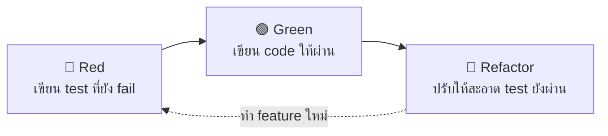

# Unit Testing with Jest <Badge type="info" text="Module 7 · สัปดาห์ 13–14" />

::: danger 🚨 เกิดอะไรขึ้นเมื่อไม่มี Unit Test?
นักเรียนแก้ไขฟังก์ชัน `createTask()` ใน Task Tracker ให้รองรับ priority ใหม่
ทุกอย่างดูโอเค... deploy ขึ้น production แล้ว

ผู้ใช้รายงาน: **"task ที่สร้างใหม่ทั้งหมดหายไปจาก list"**

สาเหตุ: การแก้ `createTask()` ทำให้ `getAllTasks()` พังโดยไม่รู้ตัว
**ถ้ามี Unit Test — จะรู้ภายใน 3 วินาทีหลัง save ไฟล์**
:::

> 💡 **เปรียบเทียบ:** Unit Test เหมือนการทดสอบแต่ละชิ้นส่วนรถก่อนประกอบ — ตรวจเบรกก่อน ตรวจพวงมาลัยก่อน ถ้าชิ้นส่วนดีทุกชิ้น รถสำเร็จรูปก็มั่นใจได้มากขึ้น


## ขั้นตอนที่ 1 — ติดตั้งและตั้งค่า Jest

```bash
# ติดตั้ง Jest + TypeScript support
npm install --save-dev jest @types/jest ts-jest
```

Terminal แสดงผล:
```
added 3 packages in 2s
```

เพิ่ม config ใน `package.json`:

::: code-group
```json [package.json]
{
  "scripts": {
    "test": "jest",                          // [1] รัน test ทั้งหมด
    "test:watch": "jest --watch",            // [2] รัน test แบบ live reload
    "test:coverage": "jest --coverage"       // [3] รัน test พร้อมดู coverage
  },
  "jest": {
    "preset": "ts-jest",                     // [4] ใช้ ts-jest แปลง TypeScript
    "testEnvironment": "node",               // [5] รันใน Node.js ไม่ใช่ browser
    "testMatch": ["**/*.test.ts"]            // [6] หา test ไฟล์ที่ลงท้าย .test.ts
  }
}
```
:::

โครงสร้างไฟล์ที่ควรมี:
```
src/
├── utils/
│   └── taskUtils.ts          ← ฟังก์ชันที่จะ test
tests/
└── unit/
    └── taskUtils.test.ts     ← Unit Test อยู่แยก folder ต่างหาก
```


## ขั้นตอนที่ 2 — Unit Test แรก: describe / it / expect

เขียน test สำหรับฟังก์ชัน `validateTask` ที่ตรวจสอบข้อมูลก่อนสร้าง task:

::: code-group
```ts [tests/unit/taskUtils.test.ts]
import { validateTask } from '../../src/utils/taskUtils' // [1] import ฟังก์ชันที่จะ test

describe('validateTask', () => {            // [2] กลุ่มของ test (เหมือน folder)

  it('should return true for valid task', () => {         // [3] test case หนึ่งชิ้น
    const task = { title: 'Buy milk', priority: 2 }
    expect(validateTask(task)).toBe(true)   // [4] ตรวจว่าผลลัพธ์ตรงกับที่คาดไว้
  })

  it('should return false when title is empty', () => {   // [5] test กรณีพิเศษ
    const task = { title: '', priority: 2 }
    expect(validateTask(task)).toBe(false)
  })

  it('should return false when priority is out of range', () => {
    const task = { title: 'Buy milk', priority: 10 }     // [6] priority เกิน 1-5
    expect(validateTask(task)).toBe(false)
  })
})
```

```ts [src/utils/taskUtils.ts]
interface TaskInput {
  title: string
  priority: number
}

// ฟังก์ชันที่ถูก test
export function validateTask(task: TaskInput): boolean {
  if (!task.title || task.title.trim() === '') return false  // [1] title ห้ามว่าง
  if (task.priority < 1 || task.priority > 5) return false  // [2] priority ต้องอยู่ใน 1-5
  return true
}
```
:::

รัน test:
```bash
npm test
```

Expected output:
```
PASS  tests/unit/taskUtils.test.ts
  validateTask
    ✓ should return true for valid task (2ms)
    ✓ should return false when title is empty (1ms)
    ✓ should return false when priority is out of range

Tests: 3 passed, 3 total
```


## ขั้นตอนที่ 3 — Matchers ที่ใช้บ่อยใน Jest

::: code-group
```ts [✅ Matchers พื้นฐาน]
// ตรวจค่าเท่ากัน
expect(result).toBe(42)              // [1] เปรียบเทียบแบบ === (primitive)
expect(result).toEqual({ id: 1 })    // [2] เปรียบเทียบ object (deep equal)

// ตรวจ array
expect(tasks).toHaveLength(3)        // [3] ตรวจจำนวน element
expect(tasks).toContainEqual({ id: 1, title: 'Buy milk' }) // [4] ตรวจว่ามี element นี้ไหม

// ตรวจ string
expect(message).toMatch(/error/i)    // [5] ตรวจด้วย regex

// ตรวจ error
expect(() => deleteTask(-1)).toThrow('Invalid ID') // [6] ตรวจว่า throw error
```

```ts [❌ ข้อผิดพลาดที่พบบ่อย]
// ❌ ใช้ toBe กับ object — จะ fail เสมอ แม้ข้อมูลเหมือนกัน
expect({ id: 1 }).toBe({ id: 1 })    // ❌ เพราะ object คนละ reference

// ✅ ควรใช้ toEqual แทน
expect({ id: 1 }).toEqual({ id: 1 }) // ✅ เปรียบเทียบ value ทุก property
```

```ts [💡 Matchers ที่มีประโยชน์]
// ตรวจว่า truthy/falsy
expect(result).toBeTruthy()          // true, 1, "text", [], {} ผ่านหมด
expect(result).toBeFalsy()           // false, 0, "", null, undefined ผ่านหมด

// ตรวจว่า defined
expect(task).toBeDefined()           // ไม่ใช่ undefined
expect(task.id).not.toBeNull()       // ไม่ใช่ null
```
:::


## ขั้นตอนที่ 4 — Mock Functions

เมื่อฟังก์ชันที่ test มี dependency เช่น อ่านจากไฟล์ JSON ต้องใช้ Mock:

::: code-group
```ts [✅ Mock ด้วย jest.fn()]
import { createTask } from '../../src/routes/tasks'
import * as storage from '../../src/utils/storage'    // [1] import module ที่จะ mock

// Mock ฟังก์ชัน saveTasks ไม่ให้เขียนไฟล์จริง
jest.spyOn(storage, 'saveTasks').mockImplementation(() => {}) // [2] แทนที่ด้วย mock
jest.spyOn(storage, 'loadTasks').mockReturnValue([])          // [3] คืนค่าที่กำหนดเอง

describe('createTask', () => {
  it('should add task to list', () => {
    createTask({ title: 'Buy milk', priority: 2 })

    expect(storage.saveTasks).toHaveBeenCalledTimes(1)  // [4] ตรวจว่าถูกเรียก
    expect(storage.saveTasks).toHaveBeenCalledWith(     // [5] ตรวจว่าถูกเรียกด้วย argument อะไร
      expect.arrayContaining([
        expect.objectContaining({ title: 'Buy milk' })
      ])
    )
  })
})
```

```ts [❌ ไม่ Mock — test ผิดวัตถุประสงค์]
// ❌ ถ้าไม่ mock จะเขียนไฟล์จริงทุกครั้งที่รัน test
// ทำให้ test ช้า และ test data ปนกับ production data

describe('createTask', () => {
  it('should add task', () => {
    createTask({ title: 'Buy milk', priority: 2 }) // ❌ เขียน tasks.json จริง
    // แล้ว test ต่อไปจะได้ข้อมูลปนกัน
  })
})
```
:::


## ขั้นตอนที่ 5 — Test Coverage

Coverage วัดว่า code ของเราถูก test ครอบคลุมแค่ไหน:

```bash
npm run test:coverage
```

Expected output:
```
----------|---------|----------|---------|---------|
File      | % Stmts | % Branch | % Funcs | % Lines |
----------|---------|----------|---------|---------|
taskUtils |   85.71 |    75.00 |  100.00 |   85.71 |
----------|---------|----------|---------|---------|
```

เพิ่ม coverage threshold ใน `package.json` — ถ้าต่ำกว่านี้ test fail:

```json
"jest": {
  "coverageThreshold": {
    "global": {
      "lines": 60,        // [1] ต้องครอบคลุม code อย่างน้อย 60%
      "functions": 60,    // [2] ต้องครอบคลุมฟังก์ชัน 60%
      "branches": 60      // [3] ต้องครอบคลุม if/else 60%
    }
  }
}
```


## ขั้นตอนที่ 6 — TDD: Red → Green → Refactor

TDD (Test-Driven Development) คือการเขียน test ก่อน แล้วค่อยเขียน code:



::: code-group
```ts [🔴 Red — เขียน test ก่อน]
// เขียน test สำหรับฟังก์ชัน filterByPriority ที่ยังไม่มี

describe('filterByPriority', () => {
  it('should return tasks with priority >= minPriority', () => {
    const tasks = [
      { id: 1, title: 'Low', priority: 1 },
      { id: 2, title: 'High', priority: 4 },
    ]
    const result = filterByPriority(tasks, 3)       // ฟังก์ชันยังไม่มี → test fail 🔴
    expect(result).toHaveLength(1)
    expect(result[0].title).toBe('High')
  })
})
```

```ts [🟢 Green — เขียน code ให้ผ่าน]
// เขียน code ให้ test ผ่านก่อน ยังไม่ต้องสวย

export function filterByPriority(tasks: Task[], minPriority: number): Task[] {
  return tasks.filter(task => task.priority >= minPriority) // 🟢 test ผ่าน
}
```

```ts [🔵 Refactor — ปรับให้ดีขึ้น test ต้องยังผ่าน]
// เพิ่ม type safety + guard clause
export function filterByPriority(tasks: Task[], minPriority: number): Task[] {
  if (minPriority < 1 || minPriority > 5) {
    throw new Error(`Invalid minPriority: ${minPriority}`)
  }
  return tasks.filter(task => task.priority >= minPriority) // 🔵 refactor แล้ว test ยังผ่าน
}
```
:::


## 🤖 AI Prompt Guide

::: info 💬 ถาม AI เมื่อติดขัด
**สถานการณ์ที่ 1:** ไม่รู้จะ test อะไรใน function นี้
> "ฟังก์ชันนี้ควรมี unit test กี่ case และ test อะไรบ้าง: `[วาง code ฟังก์ชัน]`"

**สถานการณ์ที่ 2:** ต้องการ Mock ฟังก์ชันที่ซับซ้อน
> "ช่วยเขียน Jest mock สำหรับฟังก์ชันนี้ที่อ่านไฟล์ JSON: `[วาง code]`"

**สถานการณ์ที่ 3:** Coverage ต่ำ ไม่รู้ต้องเพิ่ม test ที่ไหน
> "Jest coverage report แสดง branch coverage 40% สำหรับไฟล์นี้ ช่วยบอกว่าควรเพิ่ม test case ไหน: `[วาง code ฟังก์ชัน]`"
:::


## ✅ Progress

### 🗣️ Code Review

::: details ❓ 1. ทำไมต้องใช้ toEqual แทน toBe เมื่อ test object?
**แนวคำตอบ:**
`toBe` ใช้ `===` เปรียบเทียบ reference — object สองตัวที่มีข้อมูลเหมือนกันแต่สร้างคนละครั้งจะไม่เท่ากัน
`toEqual` เปรียบเทียบ value ทุก property แบบ deep — เหมาะกับ object และ array
ตัวอย่าง: `{ id: 1 } === { id: 1 }` คือ `false` แต่ `toEqual` ผ่าน
:::

::: details ❓ 2. ทำไมต้อง Mock ฟังก์ชันที่อ่าน/เขียนไฟล์ในการทำ Unit Test?
**แนวคำตอบ:**
Unit Test ต้องเร็วและ deterministic (ผลลัพธ์แน่นอน) — การอ่าน/เขียนไฟล์จริงช้าและอาจเปลี่ยนแปลงข้อมูล
Mock แทนที่ I/O จริงด้วยค่าที่กำหนดเอง ทำให้ test ทำงานได้คนเดียวโดยไม่ขึ้นกับ filesystem
นอกจากนี้ยังทำให้ทดสอบ edge case ได้ง่าย เช่น จำลองว่าไฟล์อ่านไม่ได้
:::

::: details ❓ 3. TDD ต่างจากการเขียน test หลังเขียน code อย่างไร?
**แนวคำตอบ:**
TDD: เขียน test ก่อน → code ถูก design ให้ testable ตั้งแต่ต้น → มักได้ interface ที่สะอาดกว่า
Test-after: เขียน code ก่อน → บางครั้ง code ยาก test เพราะไม่ได้ออกแบบมาเพื่อ test
ข้อดีของ TDD: มั่นใจ 100% ว่า test ตรวจสิ่งที่ควรตรวจ เพราะ test เคย fail มาก่อน
:::

::: details ❓ 4. Coverage 100% หมายความว่า code ไม่มี bug ไหม?
**แนวคำตอบ:**
ไม่ — Coverage วัดแค่ว่า code ถูก "รันผ่าน" ระหว่าง test ไม่ได้วัดว่าทดสอบครบทุก scenario
ตัวอย่าง: ฟังก์ชัน `divide(a, b)` ที่ test แค่ `divide(10, 2)` จะได้ coverage 100% แต่ไม่มี test สำหรับ `divide(10, 0)` ซึ่งพัง
Coverage เป็น metric ที่มีประโยชน์ แต่ต้องคู่กับ test ที่มีคุณภาพ
:::


### 📋 Rubric (10 คะแนน)

| เกณฑ์ | ดีมาก (3-4) | พอใช้ (1-2) | ปรับปรุง (0) |
| :--- | :--- | :--- | :--- |
| **เขียน Test ได้ถูกต้อง** | test ผ่านหมด ครอบคลุม happy path + error case + edge case | test ผ่านบางส่วน ครอบคลุมแค่ happy path | test ไม่ผ่าน หรือเขียนไม่ได้ |
| **ใช้ Mock อย่างเหมาะสม** | Mock dependency ทั้งหมดที่เป็น I/O หรือ external | Mock บางส่วน | ไม่มี Mock ทดสอบของจริงทั้งหมด |
| **Coverage ≥ 60%** | Coverage ≥ 80% พร้อม threshold ใน config | Coverage 60-79% | Coverage < 60% |


### 📚 CLIL Vocabulary

| Technical Term | ความหมายในบริบทนี้ |
| :--- | :--- |
| **Unit Test** | การทดสอบ function/module ย่อยแบบแยกออกมาเดี่ยว ๆ |
| **Test Suite** | กลุ่มของ test cases ที่เกี่ยวข้องกัน (ใช้ `describe`) |
| **Test Case** | การทดสอบ scenario หนึ่งชิ้น (ใช้ `it` หรือ `test`) |
| **Assertion** | การตรวจสอบผลลัพธ์ว่าตรงกับที่คาดไว้ (ใช้ `expect`) |
| **Matcher** | วิธีการตรวจสอบ เช่น `toBe`, `toEqual`, `toHaveLength` |
| **Mock** | object/function จำลองที่แทนที่ dependency จริง |
| **Coverage** | % ของ code ที่ถูกรันระหว่างทดสอบ |
| **TDD** | Test-Driven Development — เขียน test ก่อน code |
| **Happy Path** | กรณีที่ทุกอย่างทำงานปกติไม่มี error |
| **Edge Case** | กรณีพิเศษที่อยู่ขอบของข้อกำหนด เช่น ค่าว่าง ค่าสูงสุด |
