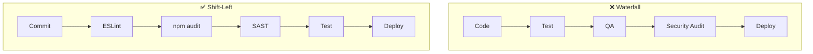

# Security & Code Quality — ESLint & OWASP <Badge type="info" text="Module 7 · สัปดาห์ 13–14" />

> **Ref Book:** Alice and Bob Learn Application Security — Chapter 1–4


## 🧹 Code Quality — Code รันได้ ≠ Code ที่ดี

```typescript
// ❌ รันได้ แต่ code แย่มาก
function f(x: any) {
  var result = []
  for (var i = 0; i < x.length; i++) {
    if (x[i].done == true) { result.push(x[i]) }
  }
  return result
}

// ✅ รันได้ และ code ดี
function getCompletedTasks(tasks: Task[]): Task[] {
  return tasks.filter(task => task.done === true)
}
```

Code ที่ดีต้องอ่านง่าย ชื่อสื่อความหมาย ไม่มี magic number และทีมทุกคนเข้าใจตรงกัน


## 🔍 ESLint — ตำรวจ Code Quality

**ESLint** วิเคราะห์ code แบบ static (ไม่รัน) หาปัญหาก่อนถึงมือ user

### ติดตั้ง

```bash
npm install --save-dev \
  eslint \
  @typescript-eslint/parser \
  @typescript-eslint/eslint-plugin
```

### ตั้งค่า `.eslintrc.json`

```json
{
  "parser": "@typescript-eslint/parser",
  "plugins": ["@typescript-eslint"],
  "extends": [
    "eslint:recommended",
    "plugin:@typescript-eslint/recommended"
  ],
  "rules": {
    "no-console": "warn",
    "no-unused-vars": "error",
    "@typescript-eslint/no-explicit-any": "warn",
    "@typescript-eslint/explicit-function-return-type": "warn",
    "eqeqeq": ["error", "always"],
    "no-var": "error",
    "prefer-const": "error"
  },
  "ignorePatterns": ["dist/", "node_modules/"]
}
```

### ใช้งาน

```bash
# ตรวจหา error
npm run lint

# แก้อัตโนมัติ (ที่แก้ได้)
npm run lint:fix

# เพิ่มใน package.json
```
```json
{
  "scripts": {
    "lint": "eslint src --ext .ts",
    "lint:fix": "eslint src --ext .ts --fix"
  }
}
```

### Rules ที่ควรเปิด

| Rule | ปัญหาที่จับ |
| :--- | :--- |
| `no-unused-vars` | variable ที่ประกาศแต่ไม่ใช้ |
| `eqeqeq` | ใช้ `==` แทน `===` |
| `no-var` | ใช้ `var` แทน `const`/`let` |
| `no-console` | ลืมลบ `console.log` ออกจาก production code |
| `no-explicit-any` | ใช้ `any` ซึ่งทำลาย TypeScript |


## 🛡️ OWASP Top 10 — ช่องโหว่ที่พบบ่อยที่สุด

**OWASP (Open Web Application Security Project)** รวบรวมช่องโหว่เว็บ 10 อันดับที่อันตรายที่สุด

### A01: Broken Access Control

```typescript
// ❌ ไม่มีการตรวจสอบว่า user มีสิทธิ์ลบ task ของคนอื่น
app.delete('/tasks/:id', async (req, res) => {
  await db.delete('tasks', req.params.id)  // ลบ task ของใครก็ได้!
  res.json({ deleted: true })
})

// ✅ ตรวจสอบ ownership ก่อน
app.delete('/tasks/:id', authenticate, async (req, res) => {
  const task = await db.find('tasks', req.params.id)
  if (task.userId !== req.user.id) {
    return res.status(403).json({ error: 'Forbidden' })
  }
  await db.delete('tasks', req.params.id)
  res.status(204).send()
})
```

### A02: Cryptographic Failures (Sensitive Data Exposure)

```typescript
// ❌ เก็บ password เป็น plaintext
await db.create('users', { email, password: plainPassword })

// ✅ hash ก่อนเก็บเสมอ
import bcrypt from 'bcrypt'
const hashedPassword = await bcrypt.hash(plainPassword, 12)
await db.create('users', { email, password: hashedPassword })

// ❌ ส่ง sensitive data ใน response
res.json({ user: { email, password, ssn, creditCard } })

// ✅ ส่งเฉพาะที่จำเป็น
res.json({ user: { id, email, name } })
```

### A03: Injection

```typescript
// ❌ SQL Injection — user ใส่ ' OR '1'='1 แล้วได้ข้อมูลทั้งหมด
const query = `SELECT * FROM tasks WHERE title = '${req.query.title}'`
db.query(query)

// ✅ Parameterized Query
const query = 'SELECT * FROM tasks WHERE title = $1'
db.query(query, [req.query.title])

// ❌ Command Injection
exec(`ls ${req.query.dir}`)  // dir = "; rm -rf /"

// ✅ Validate input ก่อนใช้
const safeDir = path.basename(req.query.dir)  // ตัด path traversal
```

### A07: Authentication Failures

```typescript
// ❌ JWT Secret อยู่ใน code
const token = jwt.sign(payload, 'hardcoded-secret-123')

// ✅ อ่านจาก environment variable
const token = jwt.sign(payload, process.env.JWT_SECRET!)

// ❌ ไม่มี rate limiting — brute force ได้
app.post('/login', async (req, res) => { ... })

// ✅ ใช้ rate limiter
import rateLimit from 'express-rate-limit'
const loginLimiter = rateLimit({ windowMs: 15 * 60 * 1000, max: 10 })
app.post('/login', loginLimiter, async (req, res) => { ... })
```


## 🔄 Shift-Left Security — ตรวจความปลอดภัยตั้งแต่ต้น

**Shift-Left** คือการย้ายการตรวจสอบ Security มาไว้ต้น pipeline แทนที่จะรอก่อน release



### ใน CI Pipeline

```yaml
# .github/workflows/ci.yml — Security checks
jobs:
  security:
    runs-on: ubuntu-latest
    steps:
      - uses: actions/checkout@v4
      - uses: actions/setup-node@v4
        with: { node-version: '20', cache: 'npm' }
      - run: npm ci

      - name: ESLint (Code Quality)
        run: npm run lint

      - name: npm audit (Dependency Vulnerabilities)
        run: npm audit --audit-level=high

      - name: Check for secrets in code
        uses: trufflesecurity/trufflehog@v3
        with:
          path: ./
          base: HEAD~1
```

### npm audit — ตรวจ Dependency

```bash
# ตรวจ vulnerability
npm audit

# ตัวอย่าง output
# found 3 vulnerabilities (1 moderate, 2 high)
#   high: Remote Code Execution in axios <1.6.0
#   high: Prototype Pollution in lodash <4.17.21

# แก้อัตโนมัติ
npm audit fix

# ดู report แบบ JSON สำหรับ automation
npm audit --json | jq '.vulnerabilities | length'
```


## 💡 สรุป

::: info 3 สิ่งที่ต้องทำในทุกโปรเจกต์
| Action | เครื่องมือ | เมื่อไหร่ |
| :--- | :--- | :--- |
| ตรวจ Code Quality | ESLint | ทุก commit (Husky) |
| ตรวจ Dependency CVE | `npm audit` | ทุก CI run |
| ตรวจ Secrets หลุด | GitHub Secret Scanning | อัตโนมัติ |
:::


**← ก่อนหน้า:** [Unit Testing](/wk7/wk7-content1-unit-testing)  
**ถัดไป →** [SIT / Integration Testing with Supertest](/wk7/wk7-content3-sit-integration)
