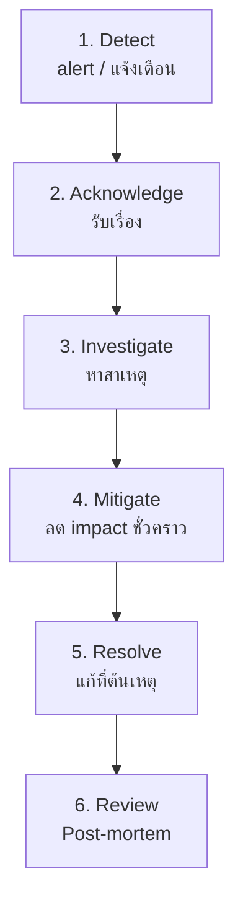

# Incident Response — เมื่อระบบล่ม <Badge type="info" text="Module 8 · สัปดาห์ 15–16" />

> **Ref Book:** The DevOps Handbook — Part IV: Feedback Loops


## 🚨 Incident คืออะไร?

**Incident** คือเหตุการณ์ที่ระบบทำงานผิดปกติจนกระทบผู้ใช้

| ประเภท | ตัวอย่าง |
| :--- | :--- |
| **Outage** | API ไม่ตอบสนองทั้งหมด |
| **Degraded Performance** | response time 5x ช้ากว่าปกติ |
| **Data Issue** | task หายไป หรือ data ผิด |
| **Security** | unauthorized access, data breach |


## 📊 Severity Levels — วัดความรุนแรง

| Level | ชื่อ | ตัวอย่าง | ต้องตอบสนองใน |
| :---: | :--- | :--- | :--- |
| **P1** | Critical | API ล่ม 100% — ผู้ใช้ทั้งหมดกระทบ | < 15 นาที |
| **P2** | Major | Feature หลักพัง — กระทบ 50%+ | < 1 ชั่วโมง |
| **P3** | Minor | Feature รองพัง — workaround มี | < 4 ชั่วโมง |
| **P4** | Low | Bug เล็กน้อย, cosmetic | next sprint |


## ⏱️ Incident Timeline




## 📖 Runbook — คู่มือสำหรับ On-call Engineer

**Runbook** คือ step-by-step guide สำหรับจัดการ incident ที่รู้จักแล้ว — เขียนไว้ก่อนที่จะเกิด

### Runbook ตัวอย่าง: Task Tracker API ไม่ตอบสนอง

```markdown
# Runbook: Task Tracker API Down

**Severity:** P1
**Owner:** @devops-team

## Symptoms
- UptimeRobot alert: Task Tracker is DOWN
- GET /health ตอบ timeout หรือ 5xx
- Users รายงานว่าใช้งานไม่ได้

## Investigation Steps

### 1. ตรวจสอบ container สถานะ
   - ไป Render Dashboard → Service → Logs
   - ดู last deploy เป็นเมื่อไหร่?
   - มี restart loop ไหม?

### 2. ตรวจสอบ health endpoint
   curl https://task-tracker.onrender.com/health
   - 200: app รันแต่อาจมีปัญหาภายใน
   - timeout: container ไม่ตอบสนอง
   - 503: Render routing พัง

### 3. ดู error logs
   Render → Logs → filter "ERROR" หรือ "FATAL"
   มี pattern อะไรก่อน incident?

## Mitigation

### ถ้า deploy ล่าสุดเป็นสาเหตุ
   Render → Deploys → เลือก deploy เก่า → Redeploy
   รอ 2 นาที → ตรวจ /health

### ถ้า container hang
   Render → Service → Manual Deploy (force restart)

### ถ้า OOM (Out of Memory)
   ดู memory usage ใน /health endpoint
   Upgrade plan ชั่วคราว

## Verification
   curl https://task-tracker.onrender.com/health
   Response ต้องเป็น: {"status": "ok", ...}
   ตรวจ UptimeRobot ว่า monitor กลับเป็น UP

## Escalation
   ถ้าแก้ไม่ได้ใน 30 นาที → แจ้ง @senior-engineer
```


## 🧠 Post-mortem — เรียนรู้โดยไม่โทษคน

**Post-mortem (Blameless)** คือการวิเคราะห์หลัง incident โดยมุ่งหาสาเหตุระบบ ไม่ใช่โทษคน

::: tip Blameless Culture
"คนทำผิด" ≠ ปัญหา — ระบบที่ทำให้คนทำผิดง่าย คือปัญหา  
เป้าหมาย: แก้ระบบ ไม่ใช่ลงโทษคน
:::

### Template Post-mortem

```markdown
# Post-mortem: Task Tracker API Outage
**Date:** 2025-04-17
**Duration:** 09:23 — 10:05 (42 นาที)
**Severity:** P1

## Timeline
- 09:23: UptimeRobot alert — Task Tracker DOWN
- 09:25: Engineer รับ alert เริ่ม investigate
- 09:35: พบว่า deploy 09:15 มี bug — memory leak
- 09:40: เริ่ม rollback
- 10:05: Rollback สำเร็จ service กลับมา UP

## Root Cause
deploy เวอร์ชัน v1.2.0 มี memory leak ใน GET /tasks endpoint
เพราะ array ไม่ถูก garbage collect → OOM หลัง 45 นาที

## Impact
- ผู้ใช้ทั้งหมด: ใช้งานไม่ได้ 42 นาที
- SLO breach: Availability เดือนนี้ลงเหลือ 99.90%

## 5 Whys
1. ทำไม API ล่ม? → OOM
2. ทำไม OOM? → memory leak ใน GET /tasks
3. ทำไมไม่จับได้? → ไม่มี memory test
4. ทำไมไม่มี memory test? → ไม่ได้คิดถึง case นี้
5. ทำไมไม่คิดถึง? → testing checklist ไม่ครอบคลุม performance

## Action Items
- [ ] เพิ่ม memory usage test ใน CI (@devA, by 2025-04-24)
- [ ] เพิ่ม memory alert ใน monitoring (@devB, by 2025-04-21)
- [ ] อัปเดต code review checklist ให้รวม memory patterns
```


## 📞 On-Call Rotation

**On-call** คือ engineer ที่รับผิดชอบตอบสนอง incident นอกเวลางาน

```
สัปดาห์ที่ 1: อรรถ (primary) + มิ้ง (backup)
สัปดาห์ที่ 2: มิ้ง (primary) + โอม (backup)
...

เครื่องมือ: PagerDuty, OpsGenie, หรือแค่ UptimeRobot + email
```


## 💡 สรุป

::: info สิ่งที่ต้องมีก่อน go production
| สิ่งที่ต้องมี | เครื่องมือ |
| :--- | :--- |
| Monitoring | UptimeRobot |
| Alert | Email notification |
| Runbook | Markdown ใน repo |
| Rollback procedure | Render Redeploy |
| Post-mortem template | ใน `/docs/runbooks/` |
:::


**← ก่อนหน้า:** [Infrastructure as Code](/wk8/wk8-content4-iac-intro)  
**ถัดไป →** [Documentation as Code](/wk8/wk8-content6-documentation-code)
