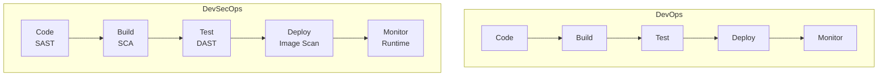
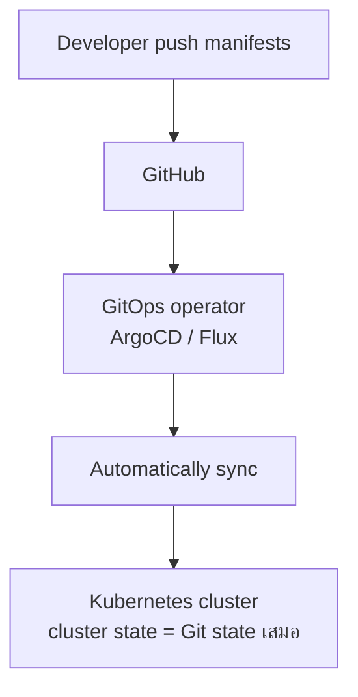

# DevOps Next Steps — เส้นทางต่อจากนี้ <Badge type="info" text="Module 9 · สัปดาห์ 17–18" />


## 🎯 ทบทวนสิ่งที่เรียนมา — DORA Metrics ของโปรเจกต์ตัวเอง

ตลอด 18 สัปดาห์นักเรียนได้สร้างระบบที่วัด DORA Metrics ได้จริง:

| DORA Metric | สิ่งที่ทำในวิชานี้ |
| :--- | :--- |
| **Deployment Frequency** | push to main → deploy อัตโนมัติ ✅ |
| **Lead Time for Changes** | commit → deploy ใน < 5 นาที ✅ |
| **Change Failure Rate** | CI block commit ที่ test fail ✅ |
| **MTTR** | Runbook + UptimeRobot alert ✅ |

```
นักเรียนเป็น Elite Performer ของตัวเองแล้ว
ตาม DORA report:
  Deployment Frequency: หลายครั้งต่อวัน ✅
  Lead Time: < 1 ชั่วโมง ✅
```


## 🐳 Kubernetes — ต่อจาก Docker Compose

**Kubernetes (K8s)** คือ Container Orchestration — จัดการ container หลายร้อยตัวบนหลาย server

### Docker Compose vs Kubernetes

```
Docker Compose — dev / small project
├── รัน containers บน 1 machine
├── restart อัตโนมัติถ้า crash
└── scale แบบง่าย

Kubernetes — production / large scale
├── รัน containers บน cluster (หลาย server)
├── self-healing: ถ้า container ตาย → สร้างใหม่อัตโนมัติ
├── rolling updates / rollback อัตโนมัติ
├── auto-scaling ตาม CPU/memory
└── service discovery + load balancing built-in
```

### Kubernetes Concepts พื้นฐาน

```yaml
# Pod — unit เล็กที่สุด (เหมือน docker run)
apiVersion: v1
kind: Pod
metadata:
  name: task-tracker
spec:
  containers:
    - name: api
      image: ghcr.io/user/task-tracker:latest
      ports:
        - containerPort: 3000

# Deployment — จัดการ Pod หลายตัว (เหมือน docker compose scale)
apiVersion: apps/v1
kind: Deployment
metadata:
  name: task-tracker
spec:
  replicas: 3          # รัน 3 instances
  template:
    spec:
      containers:
        - name: api
          image: ghcr.io/user/task-tracker:latest

# Service — load balancer ภายใน cluster
apiVersion: v1
kind: Service
spec:
  type: LoadBalancer
  ports:
    - port: 80
      targetPort: 3000
```

::: tip ลองใช้ Kubernetes ฟรี
- **minikube** — รัน K8s local บนเครื่องตัวเอง
- **kind** — K8s in Docker
- **Play with Kubernetes** — [labs.play-with-k8s.com](https://labs.play-with-k8s.com) (ฟรี 4 ชั่วโมง/session)
:::


## 🔐 DevSecOps — Security ทุกที่ใน Pipeline <Badge type="tip" text="📘 อ่านเพิ่มเติม" />

::: tip ความรู้เพิ่มเติม — ไม่ออกสอบ
สำหรับการทำ Final Exam ยังไม่ต้องใช้ DevSecOps อ่านเพื่อเข้าใจบริบทเท่านั้น
:::

**DevSecOps** = DevOps + Security ตั้งแต่ต้น ไม่ใช่ขั้นตอนสุดท้าย



| ย่อ | ชื่อเต็ม | เครื่องมือ |
| :--- | :--- | :--- |
| **SAST** | Static Application Security Testing | ESLint, SonarCloud |
| **SCA** | Software Composition Analysis | npm audit, Dependabot |
| **DAST** | Dynamic Application Security Testing | OWASP ZAP |
| **Image Scan** | Container Image Scanning | Docker Scout, Trivy |


## 🌿 GitOps — Infrastructure Managed by Git <Badge type="tip" text="📘 อ่านเพิ่มเติม" />

::: tip ความรู้เพิ่มเติม — ไม่ออกสอบ
GitOps ใช้กับ Kubernetes เป็นหลัก อ่านเพื่อเข้าใจแนวคิด ไม่ต้อง implement ใน course นี้
:::

**GitOps** คือ แนวคิดที่ให้ Git เป็น "single source of truth" ของ infrastructure ทั้งหมด


**ข้อดี:**
- ทุกการเปลี่ยนแปลง infrastructure มีใน git history
- Rollback = git revert
- Audit log ก็คือ git log


เครื่องมือ:
- **ArgoCD** — GitOps ที่ใช้มากที่สุด
- **Flux** — CNCF graduated project


## 👷 SRE vs DevOps <Badge type="tip" text="📘 อ่านเพิ่มเติม" />

::: tip ความรู้เพิ่มเติม — ไม่ออกสอบ
อ่านเพื่อประกอบการสมัครงาน ในอนาคตถ้าอยากไปสาย SRE
:::

| | DevOps | SRE (Site Reliability Engineer) |
| :--- | :--- | :--- |
| **Focus** | ทั้ง Dev และ Ops | Reliability & Scalability |
| **ต้นกำเนิด** | Culture/Mindset movement | Google สร้างขึ้น (2003) |
| **ทีม** | Dev + Ops ทำงานร่วมกัน | Software engineers ที่ทำ Ops |
| **เครื่องมือ** | CI/CD, Docker, Git | SLO/SLA, Error Budget, Toil |
| **เป้าหมาย** | Deploy เร็ว, reliable | ลด toil, maintain reliability |

SRE เหมาะกับใคร:
- ชอบ coding + infrastructure
- ชอบ data-driven decisions (SLO, metrics)
- ต้องการ salary สูงมาก (Google SRE = $200K+)


## 📜 Certifications ที่เริ่มได้เลยหลังจบวิชานี้

| Certification | ผู้ออก | ราคา | Level |
| :--- | :--- | :--- | :--- |
| **GitHub Actions** | GitHub | ฟรี | Beginner ✅ |
| **GitHub Foundations** | GitHub | ฟรี | Beginner ✅ |
| **AWS Cloud Practitioner** | AWS | $100 | Beginner |
| **Docker Certified Associate** | Docker | $195 | Intermediate |
| **CKA** (Certified Kubernetes Admin) | CNCF | $395 | Advanced |
| **Terraform Associate** | HashiCorp | $70 | Intermediate |

::: tip เริ่มจาก GitHub Certifications ก่อน — ฟรี!
1. [GitHub Actions Certification](https://www.credly.com/org/github) — ใช้ความรู้จากวิชานี้ได้เลย
2. [GitHub Foundations](https://resources.github.com/learn/certifications/) — ครอบคลุม Git, PRs, collaboration
:::


## 🗺️ Roadmap — ขั้นตอนต่อไป

```
หลังจบวิชานี้ (เรียนรู้ได้ตามลำดับ):

Month 1-2: ทำให้ Project นี้ production-ready
  ├── เพิ่ม Database จริง (PostgreSQL บน Render)
  ├── เพิ่ม Authentication (JWT)
  └── เพิ่ม Unit Test coverage ให้ถึง 80%

Month 3-4: เรียน Container Orchestration
  ├── Kubernetes fundamentals (minikube)
  ├── kubectl commands
  └── Deploy Task Tracker บน K8s

Month 5-6: เรียน Cloud Deep Dive
  ├── AWS Cloud Practitioner exam
  ├── S3, RDS, ECS บน AWS
  └── Infrastructure as Code ด้วย Terraform

Month 7-12: หาประสบการณ์
  ├── Contribute to open source projects
  ├── สร้าง Personal Project ที่ production-ready
  └── สมัครงาน Junior DevOps / Cloud Engineer
```

### แหล่งเรียนรู้ที่แนะนำ

| แหล่ง | เนื้อหา | ฟรี/จ่าย |
| :--- | :--- | :---: |
| [roadmap.sh/devops](https://roadmap.sh/devops) | DevOps learning path | ฟรี |
| [90DaysOfDevOps](https://github.com/MichaelCade/90DaysOfDevOps) | เรียน DevOps 90 วัน | ฟรี |
| [KodeKloud](https://kodekloud.com) | Labs interactive | จ่าย |
| [A Cloud Guru](https://acloudguru.com) | AWS/Azure/GCP | จ่าย |
| [The DevOps Handbook](https://itrevolution.com/product/the-devops-handbook/) | หนังสือ | จ่าย |


## 💬 สิ่งที่วิชานี้ให้ไป

::: info สิ่งที่ติดตัวหลังจากวิชานี้
ไม่ใช่แค่ "รู้ว่า Docker คืออะไร" แต่คือ **วิธีคิดแบบ DevOps**:

- 🔄 **Automate everything** — ถ้าทำซ้ำมากกว่า 2 ครั้ง ให้ script มันทำ
- 🧪 **Test first** — เขียน code → เขียน test → ทั้งสองส่วนนี้สมบูรณ์แบบด้วยกัน
- 📊 **Measure everything** — ถ้าไม่วัด ไม่รู้ว่าดีขึ้นหรือแย่ลง
- 🔐 **Security by default** — ไม่ใช่ afterthought
- 📝 **Documentation as code** — doc ที่อยู่นอก repo จะ outdated เสมอ
- 🚀 **Deploy often** — deploy บ่อย = ความเสี่ยงต่อครั้งน้อยลง
:::


**← ก่อนหน้า:** [Lab wk8: Monitoring Setup](/wk8/wk8-lab2-monitoring-setup)  
**ถัดไป →** [Final Exam](/wk9/wk9-final-exam)
